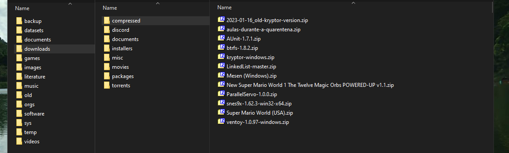

Hello again, long time no see. So, today I want to share some lessons that I've learned a while ago, my HDD started to fail and I almost lose all my 2023 data that I didn't backup. I know, an amateur mistake, trusting my `@home` subvolume (I use [BTRFS](https://wiki.archlinux.org/title/Btrfs)) into a 10yo laptop HDD. At least, I've learned my lesson and I'm currently saving some money to buy a good, or two, 1 TB SSD to setup my new development environment.

I want to talk about my perceptions about having a backup strategy, every blog post or YouTube video talks about it's importance but skip the part of how to select which files worth backing up and how to make this process automatic and efficient. I'm not talking about snapshots, that's just the first step of having a good backup police, but it's not the whole thing.
## Snapshots Aren't Enough
Ok then, let's start with snapshots. Do it – like… right now! In Windows, I don't know if there are tools that do that locally, in MacOS I know that it's possible but I don't know how to do it because I'm poor. In Linux, start using BTRFS and Timeshift for that, snapshots in Linux is very lightweight and quick to be done. I like to store one snapshot for yesterday and another for a week ago, at the very least. But the problem is, if you lose your computer in a disaster or a theft, your past snapshots are now useless.

Which brings me to this article, hope it happens to be useful for you, share it with your friends if you found that convenient. Let's dive into it already.

## The Backup Process Should Be Automatic
The problem starts here, having a backup should be a cause of concern, but actually doing the backup shouldn't be a cause of concern, let me explain. The problem of piking a day to backup all your data can be very time consuming – especially if you have a lot of data to backup – because you'll need to figure out where you'll store that data and how you'll organize all that.

Not everyone has the same setup with the same storage or the same amount of drives for that. So, the obvious conclusion is that everyone needs a unique system to automate the backup process. And that system should be trustful, because what you want is backup your date periodically automatically or by simply clicking in a button on your interface. That's why I encourage everyone that has a little more experience in development to create their own scripts and applications for that. But that solution creates another problem: How your scripts will know where everything is and where to save them?
### How Your Workflow is Related To Your Backup Strategy
This section will justify why my file system is strange and confusing for some of my friends, in the next I'll show some more details about that.

The advantages of having a organized computer is (1) you know exactly where to put everything, (2) you know where to look for some specific file or collection of files and (3) your script will also know what to backup or archive.

I already said that, but I'll repeat again, there is no bullet silver, every backup strategy is unique because everyone will sort their own files in their own ways. No rules, here you ~~can~~ need to be creative. The solution that most of people has for that is quite simple, just separate everything in your system in little boxes – e. g. having a directory for school projects in 2024, another for 2023, another folder for your personal photos and another for photos that you took in some specific event.

If you're still confused or unsure of how to organize your data in a more search friendly way, I highly recommend you to checkout the [datacurator-filetree](https://github.com/roboyoshi/datacurator-filetree?tab=readme-ov-file) repository on GitHub, there you'll find a good set of folder to store all your data that you can use for creating your own structure of folders.

## My Temporary Solution For That
I'm using my own variation of the file tree that I mentioned on the last section for a while, and I'm really satisfied with that, because – again, like I said – I know what everything is and I know exactly where to put every new stuff, no matter how weird it is.



> **Pro tip**: Try to use single words for the directory names when possible, because it makes easier to browse your files via some terminal emulator or using the the address bar of your explorer, it's faster.

As you can see in the image above, even my downloads folder is organized. And, in case you're wondering, the root directory of this tree is in `~\Desktop\data\`, and I created a link for the downloads directory, my `~\Downloads\` is pointing to `~\Desktop\data\downloads\`. Sounds complicated, but it's quite simple and intuitive after some days using a strategy like that. Enough of talking about organizing, let's see how beneficial it is when your want to do simple backups.

I like to separate some of this files in "adventures", that's how I call them. Let's look for an example, in my `~\Desktop\data\images\adventures\` directory I'll have prints and photos that I took when doing something, currently, I have just one adventure in progress called `Creating A Encrypted Dualboot Setup With Windowns And Linux\` where I'll put some prints and quick notes about what I'm learning. Then, when I finish this adventure – or when I want to save a security backup for that – I'll use a script that moves that adventure folder to `~\Desktop\data\backup\archives\`. Unfortunately, I haven't a script for that yet, the process is manual.

That `archives\` directory is important, is where I want to save every past adventure, event or collection of files that I've created in the past – projects is not necessary, because most of them is on GitHub, only the design related ones, also, the groups/projects in `~\Desktop\data\orgs\` will be there too. In the same directory of the `archives\`, I have another one called `archived\`, where I compress and save private or not-so-useful archives (most moved from `archives\`), and `offqueue\`, where I compress and encrypt my archives, all files in that folder will be stored in my Google Drive account and Dropbox soon.

About the script, I have just two yet. Both are written in Python because I'm lazy and both reads all the information that it needs in some JSON file. Here, the example below will ask the user for a password to encrypt the files with 7-zip in `archives\` and will place them in `offqueue\`, making easier for me to upload that files to the cloud. The only "problem" is that this script expects that the `archives\` directory will have only public archives.

```python
from typing import Optional
from getpass import getpass
import json, os, re

OFFSITE_ARCHIVE_INFO: str = r"C:\Users\kevin\Desktop\data\datasets\fsinfo\offsite_archive_info.backup.json"
offsite_info: Optional[dict] = None


## GET THE JSON CONFIGURATION DICTIONARY

with open(OFFSITE_ARCHIVE_INFO) as file:
  file_con = file.read()
  offsite_info = json.loads(file_con)["windows"]  #select the only `windows` config


if offsite_info is None:
  exit(1)


def user_passwd() -> str:
  while True:
    passwd = getpass("Create a encryption password (Ctrl+Shift+V to paste): ")
    passwd_confirm = getpass("Confirm password: ")

    if passwd == passwd_confirm and len(passwd) > 24:
      print("\n[ERRO]: Passwords doesn't match or lessa than 24 characters\n")
      return passwd


password = user_passwd()


for archives_dir in offsite_info["paths"]["archives"]:
  if not os.path.isdir(archives_dir):
    continue

  for archive_name in os.listdir(archives_dir):
    if re.match(offsite_info["exclude"], archive_name):
      continue

    archive = os.path.join(archives_dir, archive_name)
    
    for target_dir in offsite_info["paths"]["offqueue"]:
      if not os.path.isdir(target_dir):
        continue

      target = os.path.join(target_dir, archive_name) + ".7z"

      os.system(f'7z a -t7z -mx=9 -m0=lzma2 -p"{password}" "{target}" "{archive}" && RMDIR {archive} /S /Q')
```

The most important of them, the script below will compress and create a backup of my Obsidian vault, KeePass database and SSH keys. Not only that, the target is my local disk (of course), in `~\Desktop\data\backup\archived\` and it will for other devices too, so, if my USB drive has a `backup\archived\` directory, it will have a backup too. Which is really handy.

```python
from typing import Optional
from datetime import datetime
from getpass import getpass
import json, os

FSINFO_MUST_INCLUDE_FILES_BACKUP_JSON: str = r"C:\Users\kevin\Desktop\data\datasets\fsinfo\must_include_files.backup.json"

backup_data: Optional[str] = None
archive_name: Optional[str] = None


## get file information from the json data file

with open(FSINFO_MUST_INCLUDE_FILES_BACKUP_JSON) as file:
  file_content = file.read()
  backup_data = json.loads(file_content)["windows"]
  archive_name = datetime.now().strftime(backup_data["prefix"]) + backup_data["sufix"]

backup_data["target"] = list(map(lambda t: os.path.join(t, archive_name),  #include the archive name for each path
                                 filter(lambda t: os.path.isdir(t),
                                        backup_data["target"])))


## create the base target directory with windows system commands

for target in backup_data["target"]:
  os.system(f'MKDIR "{target}"')


## iterate for each group and copy every file/folder to the target

for group, sources in backup_data["files"].items():
  for target in backup_data["target"]:
    for source in sources:

      if os.path.isfile(source):
        os.system(f'COPY "{source}" "{target}"')

      elif os.path.isdir(source):
        source_name = os.path.basename(source)
        os.system(f'XCOPY "{source}" "{target}\\{group}\\{source_name}" /E /I')

      else:
        print(f"[ERRO]: this script only works with files/dirs, the file {source} type is invalid")


## Use the 7zip program to compress the generated snapshot

for target in backup_data["target"]:
  os.system(f'7z a -t7z -mx=9 -m0=lzma2 "{target}.7z" "{target}"')
  os.system(f'RMDIR "{target}" /S /Q')
```

Yeah, I know, quick and dirty, but I don't think that's a problem because I wont tweak these scripts so often; if it works on the first, second and third time, it's trustful enough for me. I really don't see me editing these files soon because I'm creating them with a individual purpose, also all of them is easily checkable. And – above all –, it's easy to execute these scripts, I open my bookmarked folder on my explorer that holds these scripts and double click the one I want to execute, easy like that.

In the next weeks, I'll create other scripts, I have some ideas such as a script that archives every adventure/org/design that I have stored outside my backup directory, and another script that mirror my phone files via FTP, doesn't seem so complicated to create. The only problem of using Python for that makes my backup strategy depends on a separate package in Windows, these kind of dependency is not good at all. But *meh*…

What do you think about that? Maybe it's too overengineering, but works for me. How you organize your files and how you create your backups and when? Share your strategies in the comments and if you have some question about how I solve that problem, feel free to ask there too.

