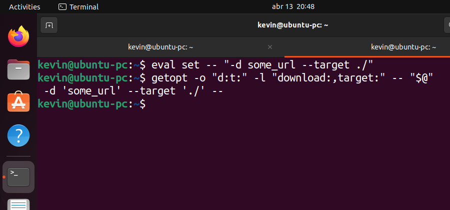

> Como é possível criar scripts com suporte à opções longas e abreviadas de forma fácil. Esse artigo representa uma parte pequena na minha jornada de "preguiçoso", ou seja, de automatizar tarefas tediosas com scripts em shell ou bash



Ganhei um notebook novo semana passada e, enquanto estava migrando meus *dotfiles* para esse PC novo, pensei que seria uma boa ideia rescrever alguns scripts pessoais que uso para fazer backup de alguns arquivos, montar o sub-volume que guardo os meus projetos do meu HDD externo, etc. Resolvi fazer isso agora por que (1) quero atualizar o meu setup de desenvolvimento e (2) aprendi algumas coisas novas nesse meio tempo que passei *offline* e gostaria de pôr o que aprendi em prática.

Enfim, hoje eu quero compartilhar algumas técnicas que aprendi recentemente que alguns *sysadmins* usam para manipular argumentos que o usuário passa quando executa algum script no terminal. Eu estou falando da ferramenta **`getopt`** do **bash** — em negrito porque é mais usado com bash do que com shell —, e ela até que é bem simples de usar: Você passa uma string com os argumentos que você quer *parsear* e ela devolve um outra string, mas com os argumentos já organizados para você mexer do jeito que achar mais conveniente.

Apesar da simplicidade, espero trazer alguns conceitos e técnicas interessantes que aprendi enquanto pesquisava por esse assunto. E, aliás, eu escrevi este artigo considerando que você já tenha uma certa familiaridade com bash ou shellscript, se você quer um tutorial mais básico, o YouTube e o Google estão ai pra isso. Sem mais delongas, vamos começar e ver se eu cometo menos erros que no último post.

## Explorando um pouco a ferramenta
Antes que as coisas fiquem confusas, acho que vale explicar a diferença entre “opção”, “parâmetro” e ”argumento” pra este artigo ficar mais claro e fácil de ler. Com **argumento**, eu me refiro a duas coias, ou eu estou me referindo ao que você escreve do lado do nome do script como um todo, ou estou me referindo à aquela parte da string que está isolada das opções. As **opções** são aqueles trechos de string que começam com `-...` ou `--...`, como `-h` ou `--help`. E algumas opções podem vir acompanhadas de **parâmetros**, como `--install neovim`, onde `--install` é uma opção e `neovim` é o parâmetro da opção.

Ok, com isso dito, se eu fosse dissecar a lógica para usar o `getopt`, eu tentaria enxergar essa ferramenta do seguinte modo:

```bash
getopt [OPÇÕES DO GETOPT] -- "[STRING DE OPÇÕES DO USUÁRIO]"
```
> **Nota:** Perceba que esse `--` no meio do comando separa o que é as opções do comando das opções que você quer *parsear*, isso é uma convenção que a maioria dos ferramentais de Unix/Linux seguem quando precisam lidar com strings que tenham `-`, `+` ou `--` no começo delas.

Nas `[OPÇÕES DO GETOPT]` você vai configurar quais opções e argumentos que o seu script recebe e em `[STRING DE OPÇÕES DO USUÁRIO]` é o que ele vai digitar do lado do nome do script — onde você provavelmente vai substituir por `"$@"`. E, no final, isso deve cuspir uma string organizada com os argumentos *parseados*, e esperamos que dê erro caso apareça algum argumento inesperado. Você pode testar isso no seu shell agora mesmo, não precisa criar um script pra ver como isso funciona.

Por exemplo, vamos supor que o usuário digitou `meu_script.bash -i neovim`, como iriamos tratar isso com o `getopt`? Primeiro, você deve passar quais são as opções válidas com `--options [STRING COM AS OPÇÕES]`, veja que no exemplo abaixo eu usei um `:` do lado do `i`, isso significa que essa opção `-i` precisa de um parâmetro. Se você precisar de mais opções, é só colocar do lado (por exemplo: `"hi:s:"`, onde `h`, `i:` e `s:` são opções diferentes). E calma que já já eu explico o que é esse `eval` e esse `set`.

```bash
eval set -- "-i neovim"
getopt --options "i:" -- "$@"
# output: -i 'neovim' --

eval set -- "-i neovim -s neofetch -h"
getopt --options "hi:s:" -- "$@"
# output: -i 'neovim' -s 'neofetch' -h --

eval set -- "-i neovim -s neofetch -h 'bla bla bla' 'hello world'"
getopt --options "hi:s:" -- "$@"
# output: -i 'neovim' -s 'neofetch' -h -- 'bla bla bla' 'hello world'
```
> **Nota:** Como pode ver, a ordem em que o usuário passa as opções/argumentos não importa. Além disso, o `--` no *output* é usado com um propósito parecido com o mencionado anteriormente, aqui ele está separando as opções (com ou sem parâmetros) dos argumentos isolados que falei.

E caso precise lidar com opções de nome longo, você pode usar a opção `--longoptions "[OPÇÕES LONGAS]"`. Na string de configuração, você vai precisar separar cada opção com uma `,` por não ser fácil de identificar onde uma termina e onde a outra começa, e a regra do `:` no final para as opções ainda está valendo.

### Como o `eval` e o `set` podem ajudar
Os três exemplos anteriores começam com uma linha bem confusa até, mas prometo que ela faz sentido. Basicamente, em shellscript, ou bashscript e similares, é comum pôr as variáveis e algumas outras coisas dentro de strings, para evitar bugs com os espaços em branco dentro delas. Só que, ironicamente, fazer isso com o comando `set` causa exatamente esse tipo de bug.

O comando `set` permite escrever na variável `$@` da sessão do shell, no caso de um script, essa variável já vem preenchida com os argumentos que o usuário passou, mas num terminal ela vem vazia, o que faz sentido.

Ai pra não sacrificar a legibilidade do programa, é comum que os programadores coloquem um `eval` no começa da linha. Esse comando só **expande** todas as strings e variáveis que está na frente dele e meio que “cola” essa linha que ele expandiu no seu código e executa ela. Essa técnica vai ser importante mais tarde, mas em resumo:

```bash
# jeito errado
set -- --install neovim
getopt --longoptions "install:" -- "$@"

# jeito "certo"
eval set -- "--install neovim"
getopt --longoptions "install:" -- "$@"
```
> **Nota:** Essa coisa de tratar tudo como uma string é questionável na minha opinião, mas é por essa mesma razão que o pessoal costuma escrever `"$@"`, entre aspas, ao invés de simplesmente `$@` em alguns casos.

## Aplicando isso num script de verdade
Por essa ferramenta ser muito simples, no sentido de você passar uma string e ela devolver outra, você consegue implementar a verificação do jeito que você julgar melhor, então aqui eu só vou mostrar um exemplo de implementação. Essa implementação não é como eu faria, porque, querendo ou não, vai depender da complexidade de cada projeto. Mas de qualquer forma, é só um exemplo, o importante é que o código no final seja claro, fácil de entender e fácil de dar manutenção.

O primeiro passo, seria você guardar o *output* desse comando para usar depois. Normalmente eu separo também as opções longas e curtas em variáveis para facilitar um pouquinho a leitura. Vale ressaltar que as opções curtas e longas são totalmente independentes entre si, nada te impede de ter como opções curtas `i:s:` e como opções longas `install:,search:,clean`, não enxergue como se uma fosse a abreviação da outra necessariamente.

```bash
OPTIONS="n:b"
LONGOPTIONS="name:,bye"
PARSED=$(getopt --options "$OPTIONS" --longoptions "$LONGOPTIONS" --name "$0" -- "$@")
```
> **Nota:** Esse `--name`, que no exemplo de cima está acompanhada com o parâmetro `$0` — que é o nome do arquivo —, é opcional. Mas ele vai ser útil, porque se o usuário digitar algo errado nos parâmetros e o `getopt`der erro, ele vai mostrar o nome do script na mensagem de erro.

Uma vez feito isso, agora é garantir que esse comando não retornou nenhum código de erro e substituir os argumentos posicionais do script, *a.k.a.* `$@`, por essa string de argumentos que já foi organizada. Depois, é legal deletar essas variáveis que não vamos usar mais no restante do programa.

```bash
[ $? -ne 0 ] && exit 1
eval set -- "$PARSED"
unset OPTIONS LONGOPTIONS PARSED
```

E pronto, agora os argumentos dentro de `$@` estão organizados, você pode usar isso do jeito que quiser. Mas a maioria dos exemplos de código que vi usam uma estratégia parecida. A ideia é criar um loop infinito e analisar sempre o primeiro elemento (`$1`), ou o segundo (`$2`) se a opção tiver um parâmetro, e ver se ela corresponde com os casos que você quer tratar. Meio complicado de explicar, mas faz mais sentido quando você vê um exemplo na prática:

```bash
while true; do
	case $1 in
		-n | --name)
			printf "%s: " "$2"
			shift 2
		;;
		-b | --bye)
			printf "Good bye!\n"
			shift; break
		;;
		*)
			printf "Hello world!\n"
			shift; break
		;;
	esac
done
```
> **Nota:** Só pra deixar claro, esse `break` não está quebrando a execução do `case` e sim todo o bloco do `while`. Então, se o interpretador do bash cair nessa linha, ele sai imediatamente do `while` e o programa continua.

O `shift` so tira os primeiros elementos de `$@`, no primeiro caso ali em cima, o `shift` tira os dois primeiros elementos dos argumentos *parseados* e o restante dos casos tira somente o primeiro. Essa manipulação de string com essas condicionais torna ele bem mais complicado de usar para alguns usuários porque ele exige que você saiba como a linguagem funciona e do que a sintaxe é capaz, mas vale a pena pela liberdade que isso te dá.

### Algumas dicas de truques adicionais
Nessa parte que você precisar rodar pela string *parseada* afim de executar determinado bloco caso tal elemento corresponda com tal opção, recomendo que você domine os comandos `shift`, `continue` e `break` para controlar o fluxo de execução do programa.

Caso esse blog post não tenha ajudado muito, dá uma lida na documentação oficial com `man getopt`, até que é bem explicadinha. E se precisa de um exemplo mais prático, talvez na sua distro exista um arquivo em `/usr/share/doc/util-linux/getopt-example.bash` que pode te ajudar. Além disso, da uma olhada nos links anexos a este post.

Na minha opinião, acho ele mais prático e completo que o `getopts` que eu costumava usar para esse tipo de coisa, mas ele exige um pouco mais de conhecimento da tecnologia em que você está trabalhando, então não é qualquer um que vai conseguir construir aplicações complexas somente com shellscript. Mas vale a pena se esforçar um pouco para automatizar essas tarefas chatas e repetitivas de baixar coisa da internet, fazer backup e etc. Espero que tenha aprendido uma coisa ou outra com esse artigo — com certeza eu aprendi escrevendo —, e obrigado por ler!

***

+ [4444 Manual Parsing vs Getopts vs Getopt 1]( https://www.youtube.com/watch?v=ZHRJvNtEX7Y)
	+ Esse é o único vídeo que achei no YouTube de alguém falando sobre essa ferramenta, talvez ajude um pouco a mudar a sua perspectiva de como esse comando, e o bash como um todo, funcionam
+ [Command Line Arguments with getopts Linux Shell Programming BASH Script Tutoria]( https://www.youtube.com/watch?v=5O4SLIDSMqg)
	+ Existe uma outra ferramenta mais antiga que faz algo parecido, dê uma olhada para ver se isso se adéqua melhor às suas necessidades
