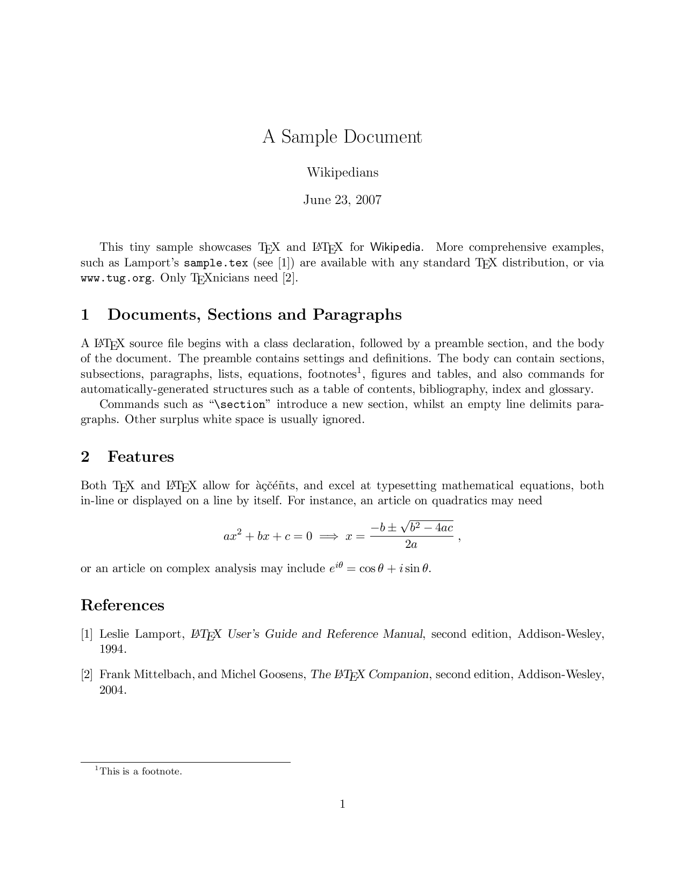
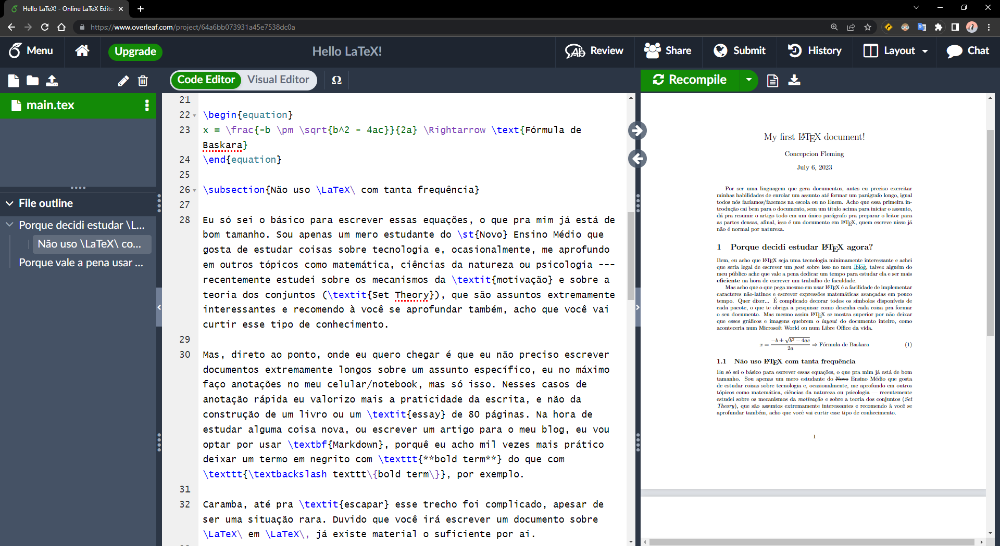

> Estou usando LaTeX a um tempo, neste post eu dou um breve contexto histórico de como essa tecnologia surgiu e comento um pouco sobre como eu a utilizo no meu dia a dia de estudante/curioso. O objetivo desse post é dar uma breve introdução de conceitos para quem pretende estudar essa linguagem, seja pra ser mais eficiente nos estudos ou só pra saber que isso existe mesmo, o que é legal também.


Eu sei, passei mais de um mês sem postar nada e, realmente, estava procrastinando, não venho me sentindo muito motivado, desculpa. Mas enfim, conversa vem, conversa vai entre amigos, o assunto $\LaTeX$ acabou surgindo, o que me pôs pra pensar um pouco. $\LaTeX$ é o tipo de ferramente que que você usa quase todo dia, dependendo do que você está estudando, e eu sabia como usar… Mas não sabia de onde surgiu esse ferramenta direito, ao menos não até agora. Fiz algumas pesquisas sobre o assunto, não só pra colecionar conhecimento mas também pra tentar entender como esse sistema funciona através de uma outra perspectiva — e também, pra ser honesto, aproveitar e me motivar a escrever artigos novos (tenho muito o que dizer, só ainda não sei exatamente como por em palavras).

Neste artigo eu pretendo resumir um pouco a história do sistema $\TeX$, como a partir dela o $\LaTeX$ surgiu, um mini tutorial de como escrever um documento em $\LaTeX$ juntamente com recomendações de software para praticar, uma breve filosofada em qual tipo de *workflow* é o melhor (“*What you see is what you **get***” ou “*What you see is what you **mean***”) e um breve comentário de como eu uso $\LaTeX$ no meu dia a dia e como pretendo melhorar minha estratégia com essa ferramenta. Espero que consiga aprender algo novo nesse post ou aprimorar suas ideias já existentes, me avise se encontrar algum erro de qualquer natureza e não deixe de compartilhar suas métricas de estudo, com ou sem o uso de $\LaTeX$ ou similares, nos comentários (eu ainda sou um estudante, afinal de contas). Sem mais delongas, *let’s go*!

## Como o TeX e o LaTeX surgiram

Durante a primeira edição do livro “*The Art of Computer Programming*”, publicada em 1968, os livros de [Donald Knuth](https://en.wikipedia.org/wiki/Donald_Knuth) eram impressos usando a técnica de [*Hot Metal Typesetting*](https://en.wikipedia.org/wiki/Hot_metal_typesetting), no qual os *tipos* (os “carimbos” de chumbo com o formato das letras) eram soldados um no outro para formar palavras, frases, parágrafos e uma página inteira, daí uma camada de tinta era adicionada à essa placa pra depois pressionarem uma folha sobre ela, formando assim uma página do livro. As editoras que usavam essa técnica costumavam usar um conjunto característico de *tipos*, uma *família de fontes* característica, que o Donald Knuth apreciava e achava confortável de ler artigos científicos com notação matemática densa que usavam esse *typesetting* (ou *estilo*, *layout*, *design*, como preferir).

Em 30 de Março de 1977, quando Knuth recebeu as *proofs* (uma cópia de um livro para o autor revisar antes de publicá-lo) da segunda edição do seu livro, ele decepcionou-se ao folear essas cópias. Por volta dos anos 70, as editoras da época adotaram a técnica de [*Photo Typesetting*](https://en.wikipedia.org/wiki/Phototypesetting) para a construção das páginas, essa técnica usava um métodos parecido com o usado para revelar uma imagem tirada por uma camera fotográfica, a página era cuidadosamente construída num papel foto sensível negativo, depois várias folhas passavam por um processo químico com esse papel para “revelar” diferentes páginas. Durante esse processo todo, o comum acabou se tornando usar um *typesetting* diferente da técnica de *Hot Metal Typesetting*.

Revoltado com a mudança, Knuth trabalhou, no que era pra ser um projeto simples e pessoal, por mais de 10 anos no mundo da **[tipografia](https://en.wikipedia.org/wiki/Typography)** e na criação da sua própria linha de estilo e sistema para gerar documentos técnicos e científicos, o [**TeX**](https://en.wikipedia.org/wiki/TeX) — esse conjunto de letras **gregas** (*Tau*, *Epslon* e *Chi*) são a abreviação para a palavra *techne*, que pode significar tanto “arte” como “criação”, sendo a origem de palavras como “tecnologia” ou “técnica”. O objetivo de Knuth era tornar o processo de gerar documentos técnicos visualmente atraentes e com suporte a desenhar inúmeros símbolos e diagramas uma coisa fácil e acessível a todos os computadores da época.

Em apoio com o Departamento de Artes de Stanford, Knuth desenvolveu a linguagem de programação [**Metafont**](https://en.wikipedia.org/wiki/Metafont), focada na criação de fontes de computadores. Juntamente com esse sistema, Knuth desenvolveu a família de fontes [**Computer Modern**](https://en.wikipedia.org/wiki/Computer_Modern), onde ele traz de volta a família de fontes dos livros antigos dos anos 70 que ele tanto apreciava. Com isso, ele fez com que o *typesetting* que o $\TeX$ gerasse fosse com essa família de fontes. 

O $\TeX$ é um sistema **WYSIWYM** (*What you see is what you mean*), ou seja, um sistema onde você escreve um **texto** com uma determinada sintaxe e um compilador, no caso do $\TeX$, o $\TeX\ I/O$ (*input/output*), desenha e renderiza o conteúdo que você descreveu no arquivo de texto.

O $\TeX\ I/O$ foi escrito por [Guy Steele](https://en.wikipedia.org/wiki/Guy_L._Steele_Jr.) no MIT, logo depois que voltou de Stanford na época em que Knuth estava escrevendo a primeira versão do $\TeX$. O compilador foi feito na linguagem [SAIL](https://en.wikipedia.org/wiki/SAIL_(programming_language)) para o sistema operacional [*Incompatible Timesharing System*](https://en.wikipedia.org/wiki/Incompatible_Timesharing_System) da época que rodava em um [PDP-10](https://en.wikipedia.org/wiki/PDP-10).

E mais pro futuro, Knuth veio a inventar o conceito de [programação literal](https://en.wikipedia.org/wiki/Literate_programming), onde você pode escrever um documento, por exemplo, em $\TeX$, com vários blocos de códigos e suas explicações e ainda assim conseguir compilar esse documento/código para ter um projeto funcionando — Haskell é um exemplo de linguagem que têm suporte nativo a isso.

Honestamente, eu acho que [esse memorando](https://www.saildart.org/TEXDR.AFT[1,DEK]1) do [SAIL](https://en.wikipedia.org/wiki/Stanford_University_centers_and_institutes#Stanford_Artificial_Intelligence_Laboratory) (*Stanford Artificial Intelligence Laboratory*, ou “Laboratório de Inteligência Artificial da Stanford”) — que o Donald Knuth escreveu para explicar como a ferramenta que ele criou funciona, o compilador e a linguagem $\TeX$, tanto no baixo nível, para os próprios desenvolvedores da época estudarem melhor o código e evoluírem ele mais ainda com suas próprias ideias, como à alto nível, justamente para o usuário final não se preocupar muito em como o código foi feito e mais em como usá-lo para escrever documentos técnicos visualmente atraentes e confortáveis de ler — é a prova viva de como uma documentação bem escrita, mesmo que em um arquivo de texto com pouca ou nenhuma formatação/sintaxe, consegue sobreviver por tanto tempo e continuar sendo útil para as gerações futuras, além de destacar mais ainda a paixão que Knuth estava tendo pelo seu trabalho e os ideais que ele valorizou, como deixar o código fonte público para quem quiser estudar ou escrever o projeto todo de um modo que cada usuário pode escrever macros customizadas para o seu tipo específico de workflow ou documento, e acabou beneficiando praticamente todo tipo de pessoa ou universidade que queira publicar um artigo técnico.

Agora o **[LaTeX](https://en.wikipedia.org/wiki/LaTeX)**, por sua vez, criado por [Leslie Lamport](https://en.wikipedia.org/wiki/Leslie_Lamport), é um pacote de *macros* — ou *funções* se você preferir — do sistema $\TeX$, estendendo assim as funcionalidades do $\TeX$ puro com novas palavras chaves para desenhar símbolos diferentes, o que o torna uma linguagem de mais alto nível e fácil uso. Hoje o $\LaTeX$ é usado principalmente no contexto acadêmico para construir relatórios de pesquisas ou artigos científicos que dependem de expressões com notação matemática ou caracteres não-latinos de um modo geral (como o alfabeto grego ou caracteres arábicos), se tornando assim *de facto* a ferramenta padrão para esse tipo coisa.

 <!-- IMAGE -->

## Qual é o melhor? WYSIWYG ou WYSIWYM?

O paradigma de edição [**WYSIWYM**](https://en.wikipedia.org/wiki/WYSIWYM) (*What you see is what you **mean***) é aquele onde o escritor escreve o documento com  uma determinada sintaxe, ou estrutura, que vai dar forma à versão formatada, o escritor em si não têm acesso ao resultado final de imediato sem antes passar por um processo de compilação — [Markdown](https://en.wikipedia.org/wiki/Markdown), $\LaTeX$ e [HTML](https://en.wikipedia.org/wiki/HTML) são exemplos de tecnologias que seguem esse paradigma de separar o layout e estilizações do código fonte que o computador vai ler para renderizar esses elementos na tela ou em um documento. Já o paradigma [**WYSIWYG**](https://en.wikipedia.org/wiki/WYSIWYG) (*What you see is what you **get***) é o oposto, nesse paradigma, a versão formatada do documento já é apresentada ao usuário pelo próprio editor enquanto ele edita — acho que esse paradigma é mais familiar à todos nós; [Microsoft Word](https://en.wikipedia.org/wiki/Microsoft_Word), [Power Point](https://en.wikipedia.org/wiki/Microsoft_PowerPoint) e [Google Docs](https://en.wikipedia.org/wiki/Google_Docs) são exemplos de ferramentas que vão formatar um documento do jeito que você o vê no editor.

É importante lembrar que o paradigma WYSIWYM foi o primeiro a surgir, ao menos no mundo do software, pois os computadores da época não tinham suporte à mouse ou a uma interface gráfica direito, então o pessoal desse tempo não tinha muita escolha. No entanto, com a modernização e popularização do computador pessoal, podemos aplicar o paradigma WYSIWYG no nosso *workflow* de hoje. Apesar dessa facilidade de escrever documentos agora, muitos ainda preferem adotar um WYSIWYM para algumas coisas, se não pra tudo. Pessoalmente, gosto do método em que eu foco 100% no conteúdo e o computador formata tudo pra mim depois, isso facilita quando estou escrevendo um documento longo ou um artigo para o meu blog, mas não posso negar que, as vezes, é muito mais prático simplesmente abrir um [OnlyOffice Docs](https://en.wikipedia.org/wiki/OnlyOffice) da vida e começar a escrever um trabalho de escola simples e ter um resultado final razoavelmente atraente. No final do dia, cada paradigma vai trazer vantagens e desvantagens pra cada situação.

## Estrutura básica de um documento escrito em LaTeX

Assim como um bom site escrito em HTML, um documento em $\LaTeX$ precisa ser bem organizado semanticamente, com sessões e sub-sessões que façam a leitura fazer sentido. Assim como a linguagem $\TeX$ em si, estruturar um documento é o tipo de tarefa que só se aprende praticando na vida real. Mas acredito que seja possível aprender isso enquanto se estuda escrevendo um documento em $\LaTeX$. Enfim, como eu disse, assim como no HTML, você vai ter jeitos de definir um título — que no contexto do $\LaTeX$, chamamos de **sessões** —, um parágrafo, texto em negrito ou itálico e assim vai. Mas acho que é bom começarmos com a estrutura mais básica de um documento, como é formada uma página em branco, já existem tutoriais que irão explicar essas coisas melhor do que eu. Dê uma olhada nesse exemplo:

```tex
% Essa linha faz o compilador saber que ele deve compilar para um artigo,
% isso porque tem como compilar para uma apresentação de slides ou outros
% tipos de documentos.
\documentclass{article}

% Aqui eu costumo listar os pacotes que vou precisar para renderizar
% algumas coisas, esses daqui, por exemplo, são os pacotes para a notação
% matemática e para escrever blocos de código, respectivamente.
\usepackage{amsmath}
\usepackage{minted}

% Metada simples do seu documento, título, autor e data de criaçao. Essas
% informações vão aparecer no header (na parte de cima) da página.
\title{Meu primeiro documento em \LaTeX}
\author{Eu mesmo!}
\date{Dis 6 de Julho, 2023}

% E aqui você vai adicionar o conteúdo do seu documento normalmente. Assi
%  como no Markdown, os parágrafos são formados por uma, ou mais, linhas
% de texto entre duas linhas em branco.
\begin{document}
\maketitle % essa macro desenha a metadata do arquivo essa página, só isso.

Olá, mundo! Eu sou o primeiro parágrafo.

\end{document}
```

Se você realmente está interessado(a) em aprender essa linguagem, fica aqui algumas recomendações rápidas:
+ [**Overleaf**](https://www.overleaf.com/): Parecido com o Google Drive, ele é um serviço que permite você escrever seus projetos, guardá-los em cloud e ainda contribuir com o projeto de seus amigos.
+ [**LaTeX2Image**](https://latex2image.joeraut.com/): Esse é legal se você só tiver interessado em praticar a notação matemática ou gerar uma imagem para pôr na apresentação em PowerPoint que seus colegas já fizeram.

Além disso, existem inúmeros aplicativos, ferramentas e plugins pra VS Code que permitem você escrever um documento em LaTeX e visualizar em uma outra aba/janela o resultado do que você está escrevendo. Sem falar dos que te permitem mesclar Markdown+$\LaTeX$ no mesmo documento, como o [Obsidian](https://obsidian.md/) ou [Pandoc](https://pandoc.org/) — meu posts são escritos usando essa mesma estratégia.

 <!-- IMAGE -->

## Porque eu ainda prefiro Markdown

Apesar das facilidades que $\LaTeX$ traz, fora dessa situação de escrever um artigo com inúmeras páginas e capítulos, $\LaTeX$ acaba sendo meio inútil no meu dia a dia, o que nunca foi um problema. Por eu usar o Obsidian, se eu precisar de $\LaTeX$ pra escrever algo em específico, o próprio app permite que eu use essa sintaxe mesclada com Markdown, o que turbina o meu *workflow*, já que eu to aproveitando o melhor dos dois mundos. Mas depois dessa micro pesquisa, acho que vou começar a escrever documentos inteiros baseados em $\LaTeX$ a partir de agora, ao menos trabalhos de escola ou qualquer documento que eu queira que tenha um *look* mais profissional. Nas minhas anotações, vou continuar valorizando mais a praticidade e legibilidade do que a quantidade massiva de opções e glifos que o $\LaTeX$ me traz.

É isso, obrigado por ter dedicado um tempinho pra ler esse post! Compartilhe com o seus amigos se você o achou útil e me diga nos comentários como você usa $\LaTeX$ no seu dia a dia ou como você costuma escrever suas anotações. Até o meu próximo artigo!

***

+ [Overleaf: My Frist LaTeX Document](https://www.overleaf.com/read/cwffkfbttynv)
    + Enquanto eu estava fazendo minhas pesquisas, decidi escrever um documento em LaTeX, porque nunca tinha feito um do zero. Achei o processo super divertido e vou começar a usar LaTeX com mais frequência na minha vida, espero que esse meu <em>test drive</em> seja útil para você.

+ [YouTube: Why LaTeX?](https://www.youtube.com/watch?v=9eLjt5Lrocw)
    + Esse vídeo foi minha primeira fonte de pesquisa antes de mergulhar no Rabbit Hole da Wikipedia.

+ [13 Best LaTeX Editors You Must Try in 2023](https://www.techpout.com/best-latex-editors/)
    + Coleção com alguns editores de LaTeX que podem ser úteis pra você, visto que eu não experimentei muitos editores desse, talvez esse artigo sirva de base caso você esteja procurando um bom editor pra uso pessoal.