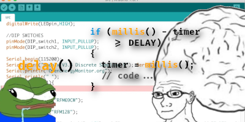

> Talvez você tenha notado que muitos hobbistas evitam usar a função delay que vêm por padrão na biblioteca do Arduino, mas tem uma razão pra isso. Quero tentar explorar uma das inúmeras estratégias abordadas para executar múltiplas atividades ao mesmo tempo apenas com uma placa (supostamente limitada) de Arduino, e tento trazer ao menos um conceito que possa ser relevante no seu dia a dia de programador(a).



Esse é o quinto post do meu blog e antes dele só houve [um post](https://kevinmarquesp.github.io/post/230407175615_manipulando-os-argumentos-posicionais-com-bashscript/) que usei para compartilhar a solução de um problema que me ocorre quase todo dia, então, cá estou eu fazendo isso novamente com esse daqui. Hoje o tema vai ser sobre Arduino, mais especificamente, irei abordar uma solução comum que a maioria dos desenvolvedores/hobbistas de robótica adotam para o seguinte problema: como fazer mais de uma tarefa ao mesmo tempo só com um único Arduino. A solução já é manjada, mas mesmo assim vou arriscar explicar esse tópico para quem ainda não entende como isso funciona, ou se você já sabe, quais são as aplicações disso e algumas coisinhas legais que aprendi brincando com projetos que envolvem essa questão.

Com esse post eu pretendo ajudar os leitores que estão passando por um problema similar e estão precisando de uma luz para resolvê-lo; ou se você já conhece essa estratégia, espero trazer uma nova forma de você olhar pra ela, e espero que os tópicos que irei abordar nesse artigo, como um todo, leve você a criar ideias e soluções criativas para os seus próprios problemas do seu cotidiano. Além do que, ensinar é uma arte e — não só como programador, mas como pessoa — é o meu dever praticá-la e aplicá-la com os outros desenvolvedores.

## O problema de multitarefa

Caso você não esteja familiarizado com essa limitação do Arduino, vale explicar qual é a razão desse erro. Em resumo, o processador do Arduino é limitado a executar somente um processo — que é o programa que você compilou e enviou para a placa —, o que, na verdade, é uma coisa muito legal da parte da equipe do Arduino. O hardware é limitado pois ele não foi feito para rodar um sistema operacional inteiro dentro dele, ele foi feito para ser barato e te ajudar a resolver um, e somente um, problema relacionado com eletrônica/automação na sua casa — o que me lembra da velha piada “seu microondas não precisa te informar sobre o clima”, e similares —, essa característica da placa barateia **muito** o hardware e o torna um produto super acessível à todas as pessoas ou escolas que pretendem usar o Arduino de forma didática. Lógico que os *Makers* de plantão também agradecem.

Daí o cidadão que quer aprender precisa trabalhar numa parada mais complexa, percebe que nada está funcionando direito e tenta fazer o “hello world” do paralelismo com o Arduino, que é fazer dois LEDs piscarem ao mesmo tempo, mas em frequências diferentes. Essa pessoa hipotética começa com o seguinte rascunho:

```c++
void setup(void)
{
  pinMode(3, OUTPUT); // led verde
  pinMode(4, OUTPUT); // led vermelho
}

void loop(void)
{
  digitalWrite(3, HIGH); delay(500);
  digitalWrite(3, LOW);  delay(500);
  
  digitalWrite(4, HIGH); delay(70);
  digitalWrite(4, LOW);  delay(70);
}
```

Para a surpresa de ninguém, esse código não funciona como o esperado. É fácil concluir que a função `delay()` está interrompendo a execução do `loop()` do pior jeito possível. O LED verde, por exemplo, fica aceso por 500 ms e apagado por 640 ms andes de acender de novo. Talvez dê para mudar o tempo que cada `delay()` vai durar, com alguma matemática é possível achar um padrão que faça sentido, mas tudo vai por água abaixo assim que introduzimos um terceiro LED. Claramente precisamos de uma solução que seja fácil de entender, que não envolva tanto microgerenciamento e que dê para aplicar diversas vezes no mesmo código.

É legal lembrar também que o Arduino em si não é tão fraco para o propósito dele, na verdade, se o [Ricoh 2A03](https://en.wikipedia.org/wiki/Ricoh_2A03) de um Nintendinho consegue renderizar na tela múltiplos tiles de martelinho e animar a gravidade deles, o seu [ATmega48A](http://ww1.microchip.com/downloads/en/DeviceDoc/ATmega48A-PA-88A-PA-168A-PA-328-P-DS-DS40002061A.pdf) consegue, em teoria, fazer dois LEDs piscarem sem problemas. Então, considere antes que o seu código apenas esteja mal escrito antes de comprar uma Raspberry Pi para construir algo que você poderia ter feito por menos de um terço do preço.


## Descrevendo a solução

Ok, sei que não é muito conveniente, mas vou tentar explicar essa solução toda em um único parágrafo, talvez esse texto seja útil para eu copiar e colar quando alguém que me perguntar sobre paralelismo com o Arduino.

Tendo em vista que a função `delay()` interrompe o fluxo da função `loop()`, a melhor abordagem — sem depender de magicas como `attachInterrupt()` ou funções similares do Arduino, que mais atrapalham do que ajudam — seria simplesmente **abolir** completamente o uso do `delay()` no seu projeto **todo**, ao menos fora do `setup()`, mas então qual é a alternativa? Felizmente uma das funções que a biblioteca Arduino nos oferece por padrão é a função `millis()`, que retorna o tempo que a placa ficou ligada em milissegundos, e dá pra explorar essa função para o que queremos. Para simular o comportamento do `delay()` (agora que começa a ficar complicado) vamos usar a estrutura condicional `if (millis() >= 500) {...}`, onde o bloco (representado pelos 3 pontinho) só será executado depois que a placa permaneceu ligada por, ao menos, 500 ms. Espera… Mas depois que tiver passado os 500 ms esse `if` sempre vai ser verdadeiro e vai executar o tempo todo! Vamos reescrever a lógica agora usando uma variável, digamos `c` de contador, que vai guardar *quando o bloco do `if` foi executado pela última vez*, e com essa informação podemos calcular quanto tempo se passou desde a última vez; vai ficar assim: `unsigned long c = 0;` no começo do meu sketch — lembrando que o `unsigned long` é porque o `millis()` pode retornar um número muito maior que um `int`  —, podemos simplesmente reescrever o bloco condicional para `if (millis() - c >= 500) { c = millis(); ... }` e *voilà*! Agora o meu bloco só vai ser executado a cada 500 ms, e sempre que executado ele vai resetar o resultado da condição para `false` novamente; tente entender que no primeiro loop o estado em que `millis() == 500` e `c == 0` vai executar o meu bloco, na segunda será `millis() == 1000` e `c == 500`, depois `1500` e `1000`, `2000` e `1500`, etc.

Bom, eu tentei, vamos para um exemplo um pouco mais prático e detalhado desse código

### Fazendo os dois LEDs piscarem

Vamos tentar replicar o exemplo do primeiro tópico desse artigo, o objetivo é tentar fazer dois LEDs pulsarem em frequências diferentes. Mas antes de começar dando um passo maior que a perna, vamos tentar focar em só fazer um LED pulsar, sem usar o `delay()`. Nos próximos exemplos eu vou pular o código do `setup()` para economizar algumas linhas aqui, assuma que esse trecho do código será o mesmo que  no exemplo anterior. Enfim, vamos focar no LED verde primeiramente.

Segundo a explicação que eu dei, nós vamos precisar de uma variável que vai guardar quando o processo foi executado pela última vez, essa variável precisa ser um `unsigned long` (ou um `uint64_t` se você for hipster), isso porque ela pode armazenar um número grande de 64-bit — não é o escopo desse post discutir como variáveis são alocadas em memória e as diferenças entre os tipos primitivos de C++ (`int`, `float`, `short`, `double`, etc), fica de lição de casa para aprofundamento, mas por enquanto entenda que `unsigned long` significa “Hey compilador, essa variável vai ser um número beeeeeem grande”. Na minha explicação eu chamei essa variável de `c`, aqui eu vou chamar de `mtpc`, na minha cabeça isso significa **Multitasking Process Counter**:

```c++
unsigned long ntpc_ledVerde = 0;

void loop(void)
{
  if (millis() - ntpc_ledVerde >= 500)
  {
    ntpc_ledVerde = millis();

    /* ...se o led estiver ligado, desligue-o
    se o led estiver desligado, ligue-o... */
  }
}
```
> É muito complicado, ao menos pra mim, descrever o que exatamente esse código está fazendo, ai eu vou depender de você se esforçar e entender porquê o bloco dentro do `if` será executado a cada 500 ms, mas se eu fosse tentar explicar, diria que esse `if` está se perguntando: “Desde a última vez (`ntpc_ledVerde`) que o eu fui executado, já se passaram (esse cálculo é feito por subtrair o contador do tempo atual, da função `millis()`) 500 milissegundos?”

Talvez você tenha percebido que ainda existe um problema, uma vez que o LED estiver ligado, na próxima vez ele precisa desligar, mas não têm um jeito fácil de saber se o LED está ligado ou desligado. Felizmente dá pra facilmente resolver isso desse jeito: vamos separar o código que vai escrever os valores na placa do código que vai modificar esses valores em tempo de execução. Dê uma olhada:

```c++
unsigned long ntpc_ledVerde = 0;
bool estadoLedVerde = LOW;

void loop(void)
{
  // essa linha vai escrever o estado, seja ele qual for
  digitalWrite(3, estadoLedVerde);

  if (millis() - ntpc_ledVerde >= 500)
  {
    ntpc_ledVerde = millis();

    // essa linha vai trocar o valor do estado
    estadoLedVerde = not estadoLedVerde;
  }
}
```

E pronto, temos um LED piscante do jeito que queríamos. Se eu quiser trocar o *“delay”* desse LED, basta apenas mudar esse `500` para outro número. Esse código é fácil de editar (confere), ele não interrompe o fluxo do `loop()` (confere), é fácil de entender (confere…) e é facilmente escalável (não-confere); vamos ver esse último agora e tentar aplicar essa lógica para o outro LED, o vermelho dessa vez:

```c++
unsigned long ntpc_ledVerde = 0;
bool estadoLedVerde = LOW;

unsigned long ntpc_ledVermelho = 0;
bool estadoLedVermelho = LOW;

void loop(void)
{
  digitalWrite(3, estadoLedVerde);
  digitalWrite(4, estadoLedVermelho);

  if (millis() - ntpc_ledVerde >= 500)
  {
    ntpc_ledVerde = millis();
    estadoLedVerde = not estadoLedVerde;
  }

  if (millis() - ntpc_ledVermelho >= 70)
  {
    ntpc_ledVermelho = millis();
    estadoLedVermelho = not estadoLedVermelho;
  }
}
```

Acho que aqui fica óbvio os maiores problemas dessa estratégia. Apesar dela funcionar corretamente, quanto mais processos o seu código tiver mais complicado ele vai ficar visualmente, quer dizer… Ainda faz total sentido pra quem já conhece como esse mecanismo de multitarefa funciona, mas um iniciante talvez ficaria muito confuso se ele precisasse editar o seu código para fazer uma outra coisa. E também, cada LED vai depender de um processo diferente e, por conta disso, vai acaber precisando de um contador próprio; como pode ver, uma das coisas que diferencia um projeto simples de um projeto desse é o espaço em memória que esse daqui depende pra funcionar — eu sei, eu sei, mesmo com uns 10 contadores, o peso deles vai ocupar uma fração dos 2 KB do microcontrolador, e mesmo com os outros componentes (strings, outras funções e objetos) o código todo talvez não passe de 70% do uso da RAM na maioria dos casos, mas é bom ter essa informação em mente.

## Conclusão

Como eu disse diversas vezes, esse é o tipo de coisa que só se aprende praticando, errando muitas vezes e concertando os erros. Se eu fosse você, já estaria criando uma conta num Tinkercad da vida e experimentando esse programa bobo de fazer 2, ou mais, LEDs piscarem e frequências diferentes. Apesar disso, dei o meu melhor em tentar apresentar o tema para você, espero que tenha sido minimamente útil de algum modo.

Deve ter ficado claro que multitarefa no Arduino é mais um problema de lógica do que limitação da placa. Quanto mais processos você adiciona, mais você vai ter que se esforçar para orquestrar o comportamento de todos eles em conjunto e a dificuldade disso vai depender do projeto que você está trabalhando. Suas ideias não vão depender de uma biblioteca ou um jeito diferente de escrever código, e sim da sua própria capacidade de resolver problemas. Ou nem isso, talvez o seu projeto seja simples o bastante pra se quer fazer o uso dessa engenharia toda, talvez só com o `delay()` você consiga atingir o seu objetivo, cabe a você identificar se o senário é favorável a isso; o que me leva ao próximo parágrafo.

Código limpo importa! Sério, um  programa bem documentado e bem escrito faz a diferença pra quem tá lendo, você deveria levar isso em consideração sempre que for escrever, principalmente se é algo público e você sabe que outras pessoas vão ver o que você escreveu. Recomendo que você seja pragmático codando os seus projetos, as vezes ele é simples e evitar ouso  `delay()` só porque “não é recomendado” torne o seu projeto potencialmente mais ilegível. É tudo um trade off: você perde uma lógica simples e amigável + espaço livre em memória para poder fazer mais coisas ao mesmo tempo e tornar o programa mais flexível à modificações, e vice versa, estamos fazendo esse tipo de decisão o tempo inteiro.

Uma coisa que não mencionei no começo desse artigo é que existe várias bibliotecas que tentam resolver esse problema, de tornar o *multitasking* do Arduíno mais legível para o usuário final, mas não disse isso por um motivo. A solução que apresentei é literalmente o esqueleto de como essas bibliotecas funcionam, se você consegue entender isso, você não terá tanta dificuldade em compreender a documentação dessas bibliotecas. Particularmente, eu não gosto de usar uma biblioteca pra esse tipo de coisa, no máximo eu escrevo uma funçãozinha que lide com isso eu mesmo, já que prefiro que meu código seja consistente com o meu estilo de programação, o que facilita no *debugging*, na implementação de funcionalidades novas e etc., além de eu realmente achar que o projeto fica mais legível de forma geral. Abstração têm os seus casos, mas bibliotecas, na minha opinião, só são realmente úteis quando elas ajudam você a não se repetir.

E é isso, obrigado por ter lido até aqui! Eu estou pretendendo fazer mais alguns posts sobre Arduino futuramente, a alguns dias eu voltei de uma competição de robótica da minha cidade (como convidado, na próxima estarei competindo) e acabei me inspirando a levar mais a sério essa plaquinha azul na minha escrivaninha — acho que pela simplicidade do código e da maioria dos projetos que já vi, sempre achei que Arduino fosse meio que “coisa de criança”, ainda acho um pouco honestamente —, eu vou reescrever uma biblioteca que fiz a quase um ano que controla múltiplos servo motores ao mesmo tempo e gostaria de documentar aqui como foi essa jornada e como essa biblioteca funciona, além disso, tem muitos conceitos de desenvolvimento de software e eletrônica que dá pra trazer ao meu blog usando o Arduino como subterfúgio para isso.

***

+ [Semáforo Inteligente](https://www.tinkercad.com/things/ciW1jeD7jp6-glorious-kieran-jaagub/editel?tenant=circuits)
    + No primeiro ano do Ensino Médio construí esse projeto, recentemente eu decidi reescrevê-lo pra ver no que dava e saiu isso. Nele eu ponho em prática tudo o que falei no artigo, e aqui você pode ver o projeto funcionando e fuçar no código o quanto quiser.
