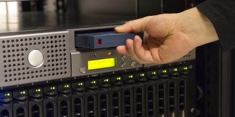

> Você provavelmente conhece ou já conheceu, alguém que perdeu dados. Fotos, vídeos, arquivos importantes, tudo perdido por apenas um descuido, uma queda, uma falha no aparelho, entre diversas outras razões. Isso não só afeta pessoas comuns, claro.  Perdas de dados geram milhões em perdas para muitas empresas.  Obviamente, existe um jeito de se prevenir contra tais infortúnios: O Backup. Mas mesmo sendo tão simples de se realizar, muitas acabam não o fazendo.

> **⚠️ Warning**: este post não é de autoria minha (Kevin Marques), ele foi escrito
> pelo **Jocadbz**, um amigo meu. Caso esteja interessado em em saber mais sobre
> ele, segue algumas informações relevantes:
> + Github: https://github.com/Jocadbz
> + Website: https://jocadbz.neocities.org/
> + Email: joaquimmadureira@protonmail.con

Você provavelmente conhece ou já conheceu, alguém que perdeu dados. Fotos, vídeos,
arquivos importantes, tudo perdido por apenas um descuido, uma queda, uma falha no
aparelho, entre diversas outras razões.
Isso não só afeta pessoas comuns, claro. Perdas de dados geram milhões em perdas
para muitas empresas.

Obviamente, existe um jeito de se prevenir contra tais infortúnios: O Backup.
Mas mesmo sendo tão simples de se realizar, muitas acabam não o fazendo.

## O que são backups?

Do dicionário: Cópia de segurança que se faz regularmente para assegurar que um
arquivo ou o conjunto de dados de um computador, ou celular, não se perca, sendo
usado quando há prejuízo ou dano no arquivo original.

Existem vários tipos de backups que podem ser realizados em um dispositivo:
- **Backup de sistema**:
  Esse backup pode ser usado quando seu sistema operacional sofrer uma falha e não
  puder ser mais utilizado. Alguns restauram o sistema inteiro com seus dados,
  outros apenas restauram a funcionalidade. Esse tipo de backup deve ser realizado
  com ferramentas específicas.
- **Backup de dados**:
  Esse tipo visa restaurar apenas os seus dados pessoais.
  Pode ser feito com basicamente qualquer ferramenta

## Por quê as pessoas não realizam backups?

Simples, elas confiam demais eu seus dispositivos.

Quero que você, meu caro leitor, pense na ultima vez que seu telefone deu algum
erro, tela azul, Kernel Panic, ou qualquer tipo de coisa que force uma formatação
imediata. Exato, raramente acontece.

Quando as pessoas veem que seus telefones não estão propensos a falhas, elas começam
a confiar que seus dados estão 100% seguros, mas esquecem que muitas outras coisas
podem acontecer. E claro, isso leva ao desastre.

## Como fazer backups?

Em seu celular, é simples: O IOS e o Android contam com ferramentas próprias para tal.

No Linux, por exemplo, diversas ferramentas podem ser utilizadas: O autor usa e recomenda
Timeshift para backups de sistema.

Para o backup de dados, qualquer técnica pode ser usada, desde ferramentas especificas,
até colocar todos em um arquivo ZIP (contanto que saiba restaurar depois).

### Seus backups estão realmente seguros?

É claro, você deve procurar encriptar seus backups, caso queira que nenhum usuário mal
intencionado olhe seus backups.

Ferramentas para backups, em sua maioria, têm uma opção que encripta seus backups.

Caso não queira depender destas, recomendo o programa **ccrypt**, que encripta qualquer
arquivo em 256-bit AES e é bem rápido.

### A regra 3-2-1

Infortúnios podem sim acontecer, e você pode sofrer uma perda de hardware aonde seu
backup pode ser perdido.

Para prevenir isso, e recomendável que você siga a regra de backups **3-2-1**.
Essa regra prevê que você faça o seguinte:
- Salve um backup em seu Disco rígido
- Salve um backup em uma midia removível
- Salve um backup na nuvem

A chance de todos os três se perderem ao mesmo tempo é basicamente nula.

## Conclusão

Backups são muito importantes nos dias atuais, e é obrigatório que você
mantenha seus backups em dia. Nunca se sabe o dia em que uma falha de hardware
pode acontecer, e se acontecer, o único jeito de restaurar seus dados é via
backup.
E caso não tenha um... eu sinto muito.
