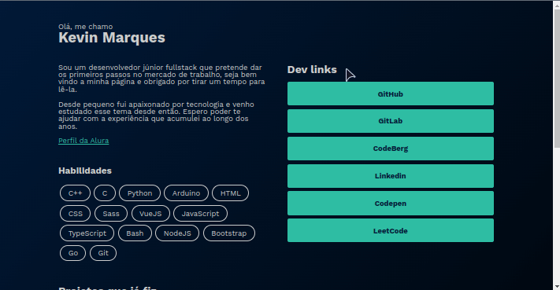
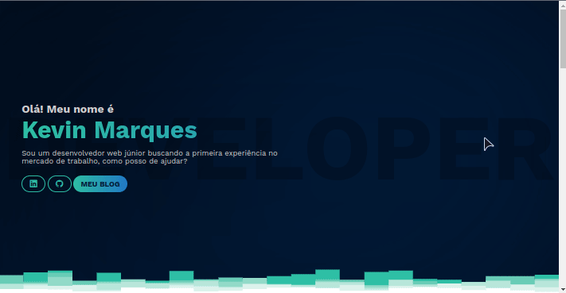

> Como eu me frustrei com front-end e porque desisti de ter uma página
> customizada para usar de portifólio.

Isso começou à muito tempo, muito mesmo. Faz uns anos que me sinto confortável o
sulficiênte para desenvolver uma página com algum HTML, algum CSS e algum
Javascript, mas eu sempre acabei deixando pra amanhâ, pra semana ou ano que vem,
e hoje finalmente cheguei a um final.

E não, não odeio front-end, apenas me frustrei nessa jornada e gostaria de
compartilhar isso com você, meu caro -- ou minha cara -- leitor(a).

## Primeiro ato: Procastinação

Poisé, faz anos que venho dizendo a amigos e família "eu vou fazer um sitezinho
pra mim", mas esse "sitezinho" nunca estava pronto. Sempre começava e parava, não
por falta de conhecimento ou intimidação, só ficava entediado e passava a querer
desenvolver outros projetos, seja front-end ou back-end.

Isso por que eu, e talvez todos os desenvolvedores iniciantes, escutam a mesma
coisa: Faça um curso, construa um portifólio, escreva um currículo e aplique pra
uma vaga. E eu não discordo totalmente desse método, só não gosto de enxergar
isso como "a" escolha certa, então passei a me sentir preso a esse compromisso
de construir um size pessoal do zero, para mostrar minhas habilidades.

Daí fiquei nesse loop, de comçar e começar denovo, por anos.

## Segundo ato: Front-end é massante

Mais uma vez repetindo, eu gosto de front-end, mas realmente acho muito massante
ter que lidar com design, UI/UX, e afins. Não julgo quem gosta, mas um bootstrap
básico pra mim, já é o bastante pra testar o back-end de uma palicação que to
criando, com uma interface até que bonitinha.

E hoje, eu realmente me sinto confortável em participar em um projeto de front.
Todas as quedas (que não foram quedas, eu só desistia e começava denovo) me
deixavam mais forte na próxima vez que tentava fazer denovo. E quanto mais eu
caía mais visível era a minha evolução no front comparado com a tentativa
anterior.

Infelizmente, minha imaturidade me levou a deletar maioria dos repositórios que
criei e usei de portifólio/blog pessoal. Mas tenho duas tentativas recentes que
irei guardar até a minha morte, esses dois projetos foram um dos top 10 projetos
que mais aprendi coisas novas o construindo (até agora).

## Terceiro ato: Tentativas passadas

Como eu disse, minhas primeiras tentativas foram deletadas da história, portanto,
não há documentações ou registros precisos de tudo o que aprendi. Mas no geral,
a ideia foi, e sempre foi, criar uma página estática e usar o [Github Pages](https://pages.github.com/)
pra hospedá-la. Inicialmente a ideia foi escrever a página toda com HTML puro.

Sei que é simples, mas aprendi muito sobre a como as tags `<meta/>` funcionam
em uma página, aprendi a organizar melhor o nome das minhas classes e porquê
o [BEM](https://getbem.com/introduction/) não funciona direito pra mim. A cada
tentativa eu pesava "parece que SCSS é mais fácil", "talvez eu devesse recomeçar
com TypeScript", e assim fui evoluindo.

Mas o problema ainda persistia, front-end já e massante, imagina criando cada
componente manualmente e várias vezes no mesmo arquivo `.html`. Certamente eu
precisava aprender algum framework pra me tornar mais produtivo.

## Quarto ato: Projetos atuais

Como eu disse, eu evolui bastante, e foi em questão de semanas até eu "aprender"
[AstroJS](https://astro.build/) e [VueJS](https://vuejs.org/), e eu fiquei bastante
feliz com o resultado desses projetos. Eu fiz os dois nesse mês e tentei levar
a sério o styles guides de cada tecnologia, o meu protfolio com AstroJS admito
que foi mais um teste do framework do que um projeto de fato, mas o de Vue, esse
eu realmente fui metódico, e ainda não foi o sulficiente pra ser proficional.

Digo isso porque eu eu não tinha um design pronto pra seguir, eu fui construindo
na hora que eu escrevia o código, e eu sei, isso é uma má ideia. De qualquer modo,
gostaria de compartilhar as coisas que aprendi do que deu errado desses projetos.

### Showcase: Experimentando o AstroJS

AstroJS é um framework poderoso, de verdade. Ele têm features o sulficiênte pra
fazer o que qualquer NextJS ou React consegue fazer, e principalmente, ele compila
pra páginas estáticas com pouco ou nada de Javascript por baixo.

Além disso, e acho q é uma das features que mais chama a atenção, é o fato de
você poder construir componentes e/ou layouts usando outros frameworks, e eu fiz
isso, usei componentes escritos em VueJS. No geral é frescura de minha parte,
porque eu to fazendo o projeto sozinho, nada me impediria de usar os *astro
components* sem tantas dificuldades, mas valeu a tentativa.

No final das contas, tudo acabou ficando meio gambiarra, os estilos estavam misturados
-- no sentido de alguns estarem no arquivo dos componentes e outros em arquivos
separados pra estilos -- e acabei usando TypeScript além da conta, podia ter usado
JSON pra deixar as coisas mais fáceis de entender. Mas está até bem legível pro
meu gosto.

> Como pode ver, essa paleta de cores é a mesma do blog que você está lendo (ao
menos que você esteja usando o tema claro). Selecionei essa paleta dos projetos
anteriores e mantive ela até hoje.

Se fosse listar as principais coisas que aprendi:
1. Não tem razão pra usar componentes de outros frameworks, o Astro sozinho já é
bom o bastante pra construir landing pages.
1. Apesar dos estilos estarem desorganizados, as variáveis e a paleta estavam
muito bem definidas, tornando fácil trocar de paleta pra fazer um tema claro, por
exemplo.
1. *Mobile first* é um conceito importante, mas não significa que deve ser seguido
à risca, pois só com os layouts do CSS é possível construir componentes responsíveis
sem se esforçar tanto ou gastar muitas linhas de código.

### Showcase: Explorando o VueJS

Sem dúvida é um dos melhores projetos que já fiz, eu realmente peguei tudo que
aprendi e deu errado dos outros projetos e apliquei nesse projeto. Fico feliz
de pensar que se eu pegar pra ler esse código daqui 10 ou 20 anos, eu vou consguir
entender o que está escrito, por ter criado um padrão de documentação e escrita
que é claro e deixei comentado no código essas coisas.

Um hábito que eu quero levar pra minha vida é justamente de listar e documentar
cada pedaço individual do projeto. Tinha criado uma lista de afazeres gerais, e
a cada item riscado da lista, eu percebia que precisava criar mais, e fui assim
até ter uma linha bem clara do que eu quero adicionar, do que preciso adicionar
e do que posso deixar pra depois.

Sério mesmo, depois dê uma olhada no `README.md` que (apesar de incompleto)
documentei alguns detalhes do desenvolvimento do projeto que **foi** útil durante
o desenvolvimento.

Coisas que aprendi nesse projeto:
1. Aprendi a planejar um projeto pra não me perder sempre que abrir o projeto.
1. Deveria ter criado uma branch separada pra cada feature nova, no caso, cada
sessão da página. Talvez dar push somente na `dev` e fazer merge na `main` no
próprio Github, e concertar os conflitos depois se precisar.
    + Disso eu não tenho certeza, irei testar nos meus próximos projetos.
1. Não deveria ter usado VueJS, é possível dar deploy pro Github Pages, mas não
é tão prático e natural como seria com o Astro ou qualquer framework que gera
páginas estáticas.
1. Commits pequenos, porém frequentes, é o que funciona.
1. Modulos em CSS são exelentes, mas não é legar chamar eles de `$style` em todos
os componentes que constroem o layout.
1. Talvez devesse separar os estilos dos *base components* em  arquivos diferentes.

## Ato final: Talvez menos realmente seja mais

Depois de todo esse esforço, anos de tentaiva e erro, eu decidi jogar tudo pela
janela e parar de vez com esses portifolios pessoais. Brincadeira, você ainda
pode ver o meu "fracaço" com front-end nesses links se tiver interesse:

+ [https://codeberg.org/kevinmarquesp/old-portfolio-vuejs](https://codeberg.org/kevinmarquesp/old-portfolio-astrojs)
+ [https://codeberg.org/kevinmarquesp/old-portfolio-vuejs](https://codeberg.org/kevinmarquesp/old-portfolio-vuejs)

Mas o verdadeiro motivo de eu só não querer ter um portifolio só meu, é por que
eu já tenho o meu blog, realmente não vejo necessidade precisar escrever uma
descrição de mim no Linkedin, no Github, ..., no meu blog e no meu portifólio.
Sem falar que eu teria que me compromissar de manter ele atualizado o tempo todo.

A grande questão aqui é praticidade, o blog é *plug and play*, como eu to usando
um tema já pronto do [HUGO](https://gohugo.io/), não preciso me preocupar com os
estilos, componentes ou similares, esse tema já me oferece tudo que eu preciso
pra criar os meus posts. E meus projetos? Nada me impede de criar uma página
dedicada a eles. Sempre estarei mexendo no repo desse blog, portanto, não vai ser
muito difícil de manter os meus projetos a mostra atualizados.

Acho isso tudo muito complicado, não só pra mim, mas pro pessoal que vai querer
ver essas páginas, se tudo está em um único lugar é mais fácil de navegar.

Mas não me arrependo de nada, aprendi muito com todos esses repositórios e tentativas
fracaçadas e muito disso eu realmente irei levar pra toda minha vida. O único
problema é que isso era a única coisa que me mantinha ativo no front-end, agora
terei que me comprometer em criar esse tipo de projeto denovo de vez em quando.
Tavez um cardápio de restaurante, um album de fotos dos meus amigos imaginários,
não sei... Vou deixar o front de lado, por enquanto, e focar em **Elixir**.