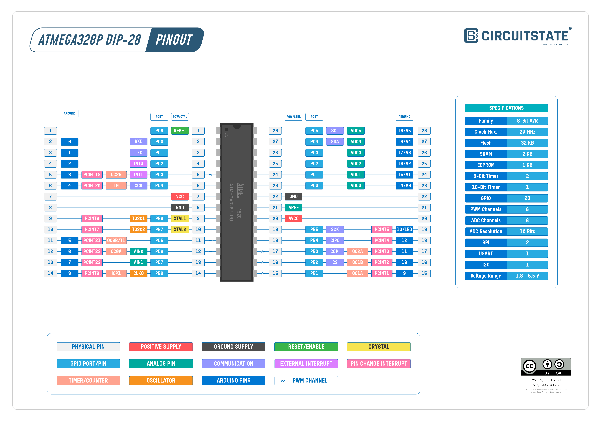

> Apenas uma pequena coletânea de algumas coisas que aprendi brincando
> com o meu Arduino UNO e ajudando meus colegas de classe a trabalhar
> com essa plaquinha azul.

Faz uns três anos já que tenho um Arduino UNO e brinco com ele de vez em quando,
apesar de ter poucos componentes ainda é divertido mexer só na parte de software
e ver até aonde eu consigo chegar em um ambiente tão limitado. Mas o tópico desse
post não é exatamente o que fiz ou faço com o meu Arduino.

O público alvo desse post seria os estudantes de ensino médio ou entusiastas de
robótica que estão estudando esse tópico atualmente e se viram na necessidade de
aprender a usar esse microcontrolador por alguma razão, justamente o pessoal que
sabe pouco ou nada da área de programação e desenvolvimento de software como um
todo.

Mas lembrando, eu também não deixo de ser um estudante, portanto, sinta-se livre,
ou melhor... me corrija se encontrar algum mal-entendido nesse artigo. Além do
mais, confira os links anexos para complementar o conteúdo daqui. Dito isso,
*let's go*.

## O que é o Arduino

Essa é manjada, mas vale ressaltar. Se você não sabe, o microcontrolador não é
a plaquinha azul, essa plaquinha é uma **abstração**[^1] para o microcontrolador de
verdade, que é aquele chip preto que (curiosidade) dá para remover da placa e
trabalhar somente com ele.

[^1]: Caso não saiba, abstração é o conceito de você tornar uma coisa que é
complicada e complexa por natureza e tornar acessível de um modo fácil. Por
exemplo: você não precisa fazer uma engenharia maluca pra acender uma lâmpada,
o interruptor já abstrai esse processo pra ti.

De fato, você não precisa de uma porta USB pra se comunicar com o computador, nem
de múltiplos pinos pra cada coisinha. Tendo um componente pra controlar o clock
e o processador [ATmega328P](https://ww1.microchip.com/downloads/en/DeviceDoc/Atmel-7810-Automotive-Microcontrollers-ATmega328P_Datasheet.pdf),
no caso do UNO, você consegue fazer tudo o que o seu professor te ensinou.

Se você realmente é *hardcore*, fica a recomendação de tentar fazer o "Hello world"
do Arduino: fazer o led do pino 13 ficar piscando, só com o chip do processador
que deve ser removível na sua placa (não é o meu caso, infelizmente).

Sei que isso é essa informação é bem básica, mas houve uma situação em que eu e
um amigo estávamos trabalhando em um projeto que a placa estava parafusada num
carrinho, e o código deu pau, como sempre. Então eu expliquei isso pra ele e
compilamos a nova versão do código em uma placa diferente, depois trocamos os
microcontroladores e deu certo -- quase quebramos alguns terminais dos dois chips
nesse processo.

### E a linguagem de programação?

Devo admitir, por um tempo acreditei que existia uma linguagem própria baseada em
C para programar para o Arduino, mas na verdade é só C++ (C++11 atualmente) que
já importa pra você as bibliotecas necessárias para se comunicar com a placa. Eu
não quero me aprofundar muito no software nesse tópico porque irei abordar isso
mais pra frente.

## Aprenda a se apaixonar pelo processo de aprendizado

Percebi que a maioria dos alunos -- interessados, porque a maior parte sequer sabe
o que está fazendo na sala -- não desenvolvem o mindset correto pra aprender esse
tipo de coisa, sinto que eles vem pras aulas pensando "vou criar algo novo", e
esse "criar" consiste em ver se existe um tutorial do projeto e fazer igual. Lógico
que dá sim pra você aprender coisas novas desse jeito, mas o quanto você extrai
de um conteúdo por seguí-lo passo a passo?

Chega a ser irritante como poucos tem alguma noção do que é possível fazer com
um Arduino. Ano passado, a minha equipe (que sempre foi esse amigo e mais umas
3 pessoas) recebeu um projeto pra ser finalizado em **duas** semanas: um robô
que prepara drinks. Pensa em vários motores num braço robótico, e com um
copo preso na ponta, pensa no movimento que essa coisa teria que fazer.

Em fim, se for pra dar um conselho, apenas desenvolva a sua curiosidade, nem que
seja pra coisas bestas. Gaste horas tentando customizar o seu Arduino IDE (sim,
"IDE" é masculino, também foi um choque pra mim), mudando pro tema escuro, mudando
a fonte. Explore o seu ambiente e tente desvendar o que você pode fazer com ele.

Por exemplo, quando comprei minha placa e escrevi o meu primeiro "Hello world",
a primeira coisa que pensei foi "como posso separar esse código em arquivos
diferentes?". Só nessa brincadeira eu aprendi:

1. Que os projetos **precisam** que o nome da pasta seja o mesmo nome do arquivo
   `.ino` dentro dela, e que os projetos não podem ser arquivos únicos;
1. A diferença entre `#include <Foo.h>` e `#include "Foo.h"` -- fazem a mesma coisa,
   mas esta é usada pra bibliotecas externas e aquela pra bibliotecas locais;
1. Como o compilador do Arduino lida com essas bibliotecas; e, por consequência
1. Como criar a minha própria biblioteca.

Não é difícil ir longe com perguntas simples, nesse caso eu só queria organizar
melhor o meu código e, de quebra, aprendi a desenvolver minhas próprias abstrações
pra resolver problemas que eu, e meus amigos, passem com uma certa frequência.

## Próximos posts

Eu tentei, mas não dá. Este artigo pode ficar muito longo e massivo se eu
simplesmente escrever tudo o que aprendi. Portanto, nos próximos posts, darei
mais detalhes de alguns temas que quero abordar. Dentre eles:

+ **A melhor IDE para Arduino**: onde eu quero fuçar mais o que o clássico
  Arduino IDE tem a oferecer e explorar mais sobre compiladores para essa
  plataforma;
+ **Criando um projeto Arduino**: discussões sobre como estruturar um projeto
  básico e como um projeto mais avançado se parece, e como podemos rodar
  testes unitários pra esse tipo de desenvolvimento; e
+ **Multiprocesso num processador single core**: exemplo prático de um projeto
  (mostrando o que expliquei no post anterior) que resolve um problema real, e
  diferentes perspectivas para o mesmo problema;

*Nota pessoal: eu estou deixando essa lista pública pra me forçar a começar a
escrever esses posts...*

Infelizmente a escola e família estão me tomando muito tempo, dei uma pequena
pausa nos meus estudos em Elixir pra focar mais em desenvolver com Arduino e
me dedicar de verdade com esse blog. Sei que esse tema ta mais relacionado com
a escola que qualquer coisa, mas faço isso mais por mérito próprio já que é
mais prático no meu contexto. Pretendo fazer posts mais geeks sobre rom hacks
de SNES que achei...

Em fim! Esse post foi mais pra dar uma perspectiva diferente do que é de fato um
microcontrolador e pra dar referências de pesquisa pro pessoal curioso. Até o
meu próximo post!