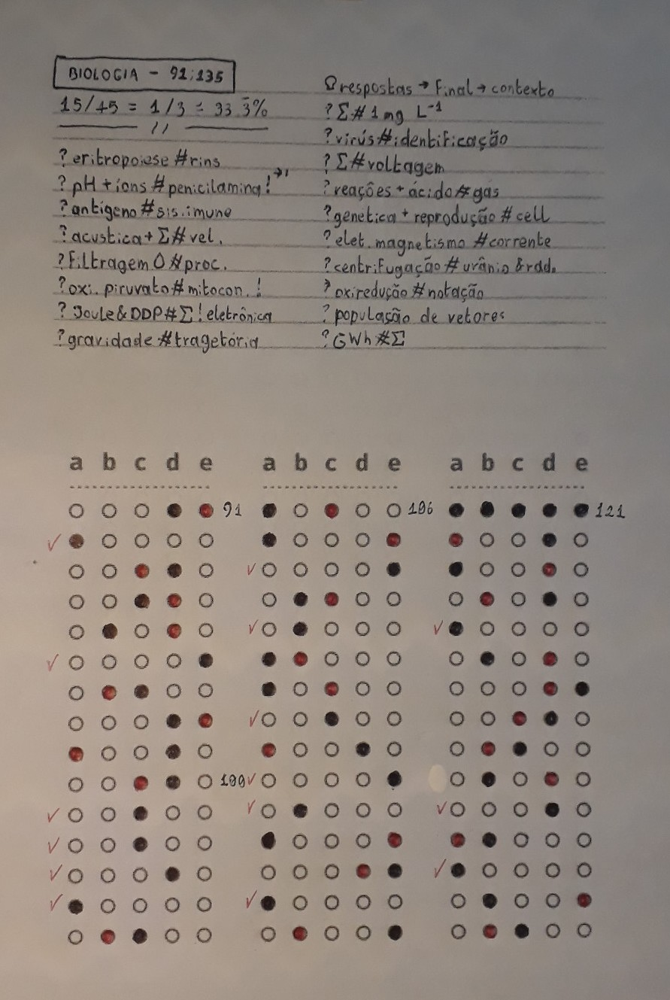
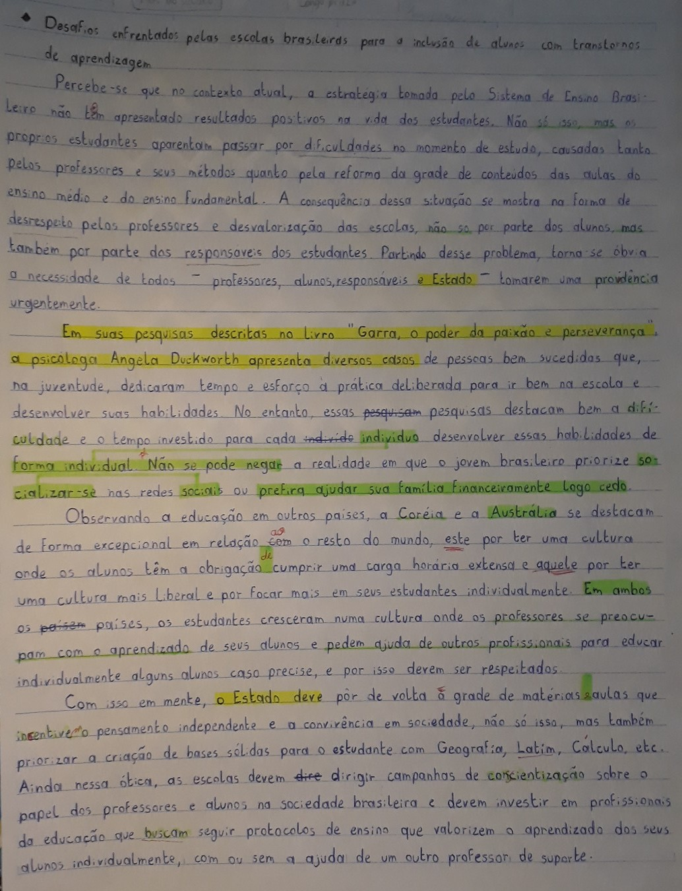

> Contexto: arquivo com um resumo das minhas anotações sobre esse(s) tópico(s) que estudei nessa semana, deve acompar uma redação de treino e os meus comentários sobre o meu desenpenho e sobre o sistema de sistema de estudo como um todo

## Teoria & prática

### Ciclos biogeoquímicos
Os **ciclos biogeoquímicos** são os ciclos percorridos por determinados elementos durante a troca de matéria da natureza. Dentre esses ciclos, os mais fáceis de entender são o ciclo da água, do oxigênio e do carbono — darei mais atenção ao ciclo do **nitrogênio**.

#### Ciclo da água
O único detalhe do ciclo da água é que ele pode ser *curto* ou *longo*, ou seja, com ou sem a presença de seres vivos nesse ciclo.

1. **Condensação**: O condensado de gás $H_2O$ junta as moléculas e as torna mais pesadas e densas (formação de nuvens);
2. **Precipitação**: As moléculas de $H_2O$ ganham massa o suficiente para descer para o solo (chuva, neve e granizo);
3. **Infiltração**: As gotas de água se juntam nos lagos, lençóis freáticos, mares, etc.;
4. **Evapotranspiração** *(presente no ciclo longo)*:  Os organismos vivos consomem a água para o seu metabolismo e libera parte dela no processo de *transpiração* ou excreção; e
5. **Evaporização**: As moléculas de água voltam para a atmosfera na forma de gás.

#### Ciclo do oxigênio e do carbono
Só duas coisas importantes. Depois de muito tempo morto, os restos orgânicos de um organismo podem formar os **combustíveis fosseis** que, quando usados, liberam $CO_2$ na atmosfera. E o carbono pode ser usado pelas plantas para formar a **glicose**, que também pode ser metabolizada por outros seres vivos que se alimentam dessas plantas.

1. **Fotossíntese**: Os organismos fotossintéticos absorvem o $CO_2$ da atmosfera e libera o $O_2$; e
2. **Respiração**: Os outros organismos absorvem o $O_2$ e liberam o $CO_2$ na atmosfera.

#### Ciclo do nitrogênio
Esse é um tanto mais complicado de entender, porque o nitrogênio é o átomo mais abundante no universo e todo ser vivo depende de nitrogênio para continuar a produzir as fitas de RNA e DNA — dentre outras proteínas —, mas não parece ter nenhum pulmão capaz de metabolizar o $N_2$ presente na atmosfera. Então a natureza encontrou um jeito de usar vários organismos diferentes para transportar esse nitrogênio para os animais.

1. **Fixação do nitrogênio**: As bactérias do gênero *Rhizobium* — que vivem numa relação simbiótica mutualista com as plantas da família *Fabaceae*[^1] — consomem o $N_2$ da atmosfera e o metaboliza, formando assim a amônia, $NH_3$;
2. **Nitrificação da amônia**: A amônia é metabolizada num processo que forma o nutriente **nitrato**, principal forma de produção de energia das plantas;
	1. **Nitrosação**: A amônia é oxidada por um outro grupo de bactérias para formação de $NO_2^-$ (nitrito) — que é toxico para o consumo das plantas;
	2. **Nitratação**: Daí um terceiro grupo de bactérias metabolizam o $NO_2^-$ para liberar o nitrato no solo, composto por $NO_3$;
3. **Desnitrificação do nitrato**: Outro grupo de bactérias consomem o nitrato para metabolizar e formar $N_2$, que é liberado de volta para a atmosfera.

[^1]: *“Faba”*, em latim, significa “sementes”, e o sufixo *“-ceae”* é uma convenção usada entre os botânicos para nomear uma família de plantas. Essas plantas são conhecidas como leguminosas e possuem flores com cores vivas e podem ter vagens repletas de sementes, também são utilizadas para restaurar solos degradados quimicamente através dessas bactérias que vivem em suas raízes.

Os seres vivos consomem o nitrogênio através da cadeia alimentar, porque vai ter os animais que irão se alimentar dessas plantas ricas em nitrogênio depois do processo de **nitrificação**. Esses organismos podem devolver o nitrogênio de volta para o solo através das excretas nitrogenadas (como a urina), que serão consumidas pelas bactérias no solo, e o ciclo se repete novamente.

### Adenosina trifosfato
É um nucleotídio que é formado por uma pentose (açúcar com 5 átomos de carbono em sua composição), **adenina** (a mesma base nitrogenada que faz parte do DNA) e um grupo de três fosfatos ionizados[^2] (onde a energia é armazenada). O ATP costuma ser usado quase na mesma hora que é formado.

[^2]: Só pra deixar claro, **íon** (do grego *”ιων”* significa *“carregar”*, *“levar”* ou *“ir”*) são todos os átomos que são eletricamente desbalanceados. Se chamam assim porque esses átomos tem a capacidade de levar **energia** — só por curiosidade, **cátion** (“kata” ou *“κατά”*) significa *“descer”* ou *“percorrer”*, isso porque ele vai em na direção do **eletrodo negativo**, por isso ele é o íon **positivo**; e **ânion** (“ana” ou “*ανά*”) significa *“separar”* ou *“subir”*, porque ele se afasta do eletrodo negativo, o que torna ele o íon **negativo**.

> **Nota**: O conceito de energia na biologia significa *“capacidade de fazer trabalho”*, e o ATP “carrega” energia porque ele carrega essa capacidade de reagir com determinadas organelas que resulta em algum *trabalho*. Tudo não passa de várias reações químicas, o ATP não é exatamente **a** energia, ele seria mais como uma bateria que é carregada e descarregada.

A energia do ATP é consumido na reação de hidrólise e pode ser representada por $\text{ATP} + H_2O \leftrightarrow P_i + \text{ADP} + \text{Energia}$. Esse **ADP** (adenosina difosfato) também pode ser consumida pelas organelas em alguns casos, liberando **AMP** (adenosina monofosfato), e ambas podem ser recicladas para a síntese de ATP novamente.

O ATP pode ser sintetizado no processo de respiração celular na mitocôndria com o uso de oxigênio, por quimiossintetizantes oxidando moléculas orgânicas, pela fotossíntese no fotossistema do organismo e por fermentação, que á oxidação incompleta da glicose sem o uso de oxigênio. De qualquer forma, o gasto e consumo de ATP é mensurável, na fermentação, por exemplo, é gasto $-2 \text{ATP}$ para produzir $+4 \text{ATP}$.

## Prática disciplinada

### Ciências da Natureza — 2º dia, prova amarela de 2022
15 respostas certas de 45 questões, um desempenho de **33%**, maioria dos acertos foram questões envolvendo biologia e química.

Lista de tópicos que eu não compreendi enquanto estava fazendo a prova:
+ Eritropoiese → rins
+ pH e reações com íons → penicilamina (importante)
+ Antígenos → sistema imunológico
+ Acústica e cálculo dessas ondas → pra chegar na velocidade
+ O processo de filtragem da água
+ Oxidação piruvato → na mitocôndria (importante)
+ O que é Joule e D.D.P. (diferença de potencial) → cálculo na eletrônica (importante)
+ Trajetória gravitacional da queda de objetos
+ O que é $1mg L^-1$ → como calcular
+ Processos para a identificação de vírus
+ Cálculo com voltagem → eletrônica
+ Reações com ácidos que liberam gases
+ Reprodução → citologia e genética
+ Corrente eletromagnética
+ Processo de centrifugação com urânio → elementos radioativos
+ Notação para entender os processos de oxirredução
+ População de vetores — *esse eu nem lembro o que é*
+ O que é $GWh$ → como calcular

### Redação dissertativa argumentativa
**Tema**: Desafios enfrentados pelas escolas brasileiras para a inclusão de alunos com transtornos de aprendizagem

*“Percebe-se que no contexto atual, a estratégia tomada pelo Sistema de Ensino Brasileiro não têm apresentado resultados positivos na vida dos estudantes. Não só isso, mas os próprios estudantes aparentam passar por dificuldades no momento de estudo, causadas tanto pelos professores e seus métodos quanto pela reforma da grade de conteúdos das aulas do ensino médio e ensino fundamental. A consequência dessa situação se mostra na forma de desrespeito pelos professores e desvalorização das escolas, não só por parte dos alunos, mas também por parte dos responsáveis dos estudantes. Partindo desse problema, torna-se óbvia a necessidade de todos — professores, alunos,responsáveis e Estado — tomarem uma provdência urgentemente.*

*Em suas pesquisas descritas no livro “Garra, o poder da paixão e perseverança”, a psicóloga Angela Duckworth apresenta diversos casos de pessoas bem sucedidas que, na juventude dedicaram tempo e esforço à prática deliberada para ir bem na escola e desenvolver suas habilidades No entanto, essas ~~pesquisam~~ pesquisas destacam bem a difículdade e o tempo investido para cada ~~indivído~~ indivíduo desenvolver essas habilidades de forma individual. Não se pode negar a realidade em que o jovem brasileiro priorize socializar-se nas redes sociais ou prefira ajudar ajudar sua família financeiramente logo cedo.*

*Observando a educação em outros países, a Coréia e a Austrália se destacam de forma excepcional em relação com o resto do mundo, este por ter uma cultura onde os alunos têm a obrigação cumprir uma carga horária extensa e aquele por ter uma cultura mais liberal e por focar mais em seus estudantes individualmente. Em ambos os países, os estudantes cresceram numa cultura onde os professores se preocupam com o aprendizado de seus alunos e pedem ajuda de outros profissionais para educar individualmente alguns alunos caso precise, e por isso devem ser respeitados.*

*Com isso em mente, o Estado deve pôr de volta à grade de matérias aulas que insentive o pensamento independente e a convivência em sociedade, não só isso, mas também priorizar a criação de bases sólidas para o estudante com Geografia, Latim, Calculo, etc. Ainda nessa ótica,  as escolas devem ~~dire~~ dirigir campanhas de concientização sobre o papel dos professores e alunos na sociedade brasileira e devem investir em profissionais da educação que buscam seguir protocolos de ensino que valorizem o aprendizado dos seus alunos individualmente, com ou sem a ajuda de um outro professor de suporte."*

## Conclusão

Eu podia ter feito anotações melhores, enquanto estava revisando, eu não entendi algumas coisas que eu mesmo tinha escrito. Nas próximas vezes preciso ter isso em mente enquanto escrevo, o *eu* do futuro vai depender dessas anotações. Mas de um modo geral, fui relativamente bem, eu estou conseguido lembrar uns 70% de tudo que estudei sobre biologia, e foi uma ótima escolha gastar um tempo para estudar o significado de algumas palavras em Latim ou Grego, finalmente consigo diferenciar *ânion* de *cátion*.

Apesar disso, eu ainda preciso treinar melhor essa técnica de *Zettelkasten* e *Kan ban*, aconteceu algumas coisas pessoais e acabei empurrando o simulado e a redação pro final da semana, acho que não escrevi direito os cards do meu *backlog* de estudos e não organizei os links de *resource* corretamente — sério, têm notas de literatura que têm mais referência que algumas *fleeting notes*.

O simulado da prova foi deprimente, ainda bem que acertei um terço da prova 5 meses antes e não no dia da prova. Tive mais dificuldades com as questões de física e algumas de química, parece que mesmo estudando muito ainda vai ter alguns buracos de conhecimento grandes em Ciências da Natureza por conta de ser um assunto extenso. O próximo passo é começar a estudar sobre **pH e suas reações**, também sobre a reação de **oxirredução e eletrólise**, só depois que voltaria para a biologia para estudar sobre **células e sobre o sistema imunológico**. Esses são os assuntos que eu considero os mais críticos que não estudei muito (sobre biologia, ainda tem as outras matérias).

E sobre a redação, meu professor de português apontou alguns erros de gramática e minha professora de filosofia — que é perita no assunto aliás — me deu 8,0 de nota por eu ter sido consistente no texto. O erro que eu preciso resolver logo é **decorar algumas citações** e dados para pôr nos 4 parágrafos. Além desse, também percebi que ando comendo algumas letras e palavras enquanto escrevo, isso aconteceu porque não houve rascunho, escrevi o texto de primeira, para economizar tempo. Tô precisando resolver as citações, escrever melhor e **me expressar de forma mais clara** no texto.

Outra coisa importante, minha letra de forma é a minha única caligrafia que é legível, preciso praticar escrever com a letra cursiva. Aparentemente o ENEM está cobrando que os textos sejam escritos desse modo agora.

---

+ **Ciclos biogeoquímicos e ciclo do hidrogênio**
    + Vídeo do YouTube: [CICLOS BIOGEOQUÍMICOS  | Quer Que Desenhe | Descomplica](https://www.youtube.com/watch?v=GkAdsxETLUs)
    + Definição: [Família de plantas *Fabaceae*](https://pt.wikipedia.org/wiki/Fabaceae)
    + Artigo: [Características gerais das leguminosas](https://sperohope.com/leguminosas)
    + Definição: [Vestibular — resumo sobre amônia](https://dicas.vestibulares.com.br/amonia/)
    + Artigo: [O que são excretas nitrogenadas](https://cursinhoparamedicina.com.br/blog/biologia/o-que-sao-excretas-nitrogenadas/)
+ **Adenosina trifosfato**
    + Vídeo do YouTube: [ATP - ADENOSINA TRIFOSFATO - ESTRUTURA E FUNÇÃO](https://youtu.be/-5VRWcGXlmA)
    + Artigo: [Energia sob a forma de ATP](https://www.sobiologia.com.br/conteudos/bioquimica/bioquimica2_2.php)
    + &star; Artigo: [ATP e acoplamento de reações](https://pt.khanacademy.org/science/biology/energy-and-enzymes/atp-reaction-coupling/a/atp-and-reaction-coupling)
    + Vídeo do YouTube: [ATP synthase in action](https://www.youtube.com/watch?v=kXpzp4RDGJI)
    + Vídeo do YouTube: [ATP in Use | HHMI BioInteractive Video](https://www.youtube.com/watch?v=vUC5njkOq7o)
    + Vídeo do YouTube: [Synthesis of ATP (2018) Drew Berry and Franc Tétaz](https://www.youtube.com/watch?v=OT5AXGS1aL8)
