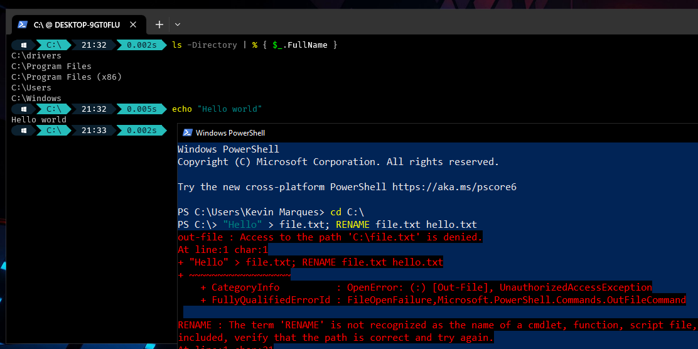

> Minhas primeiras impressões em usar o PowerShell pela primeira vez.  A linguagem de script moderna da Microsoft criada para o desenvolvedor moderno. Aqui eu discuto algumas diferenças entre a syntax da linguagem e comparo com o Bash, no final concluo qual deles é melhor para cada situação e por que.



Pois é, sucumbi ao desejo de experimentar um ferramental da Microsoft e acabai estudando um pouco o PowerShell, sei que é um ato de blasfêmia perante a comunidade que prega a liberdade e o coletivismo, mas *meh*. Brincadeiras a parte, eu tenho escutado muito que o “PowerShell é o *shell* para o desenvolvedor moderno” e que “\[…\] é fácil de aprender e prático de usar”, então decidi ver se é isso tudo mesmo, aproveitando que o Windows aqui está mais mofando enquanto não jogo Celeste.

Apesar de agora eu já ter uma base boa até, eu não comecei a estudar só por pura curiosidade, acredito que por vivermos em um mundo controlado por essas *mega corps*, aprender PowerShell não seja um investimento de tempo tão ruim. Tanto é que ele já foi útil no meu dia a dia, enquanto eu estava na escola, dei uma ajudinha para um amigo fazer o cálculo da distribuição gaussiana num dos PC’s da escola. Todo conhecimento é um investimento com saldo positivo na minha opinião, e eu precisava mudar um pouco de ar e sair do Linux para espiar o OS dos meus amigos e professores.

Enfim, tentarei não ser muito técnico e abordar os detalhes da linguagem nesse post, afinal, se você quer aprender, você pode fazer isso sozinho sem problema nenhum — a documentação é muito boa e têm vários tutorias/cursos por ai, mas mesmo assim listarei algumas das fontes que usei para pesquisar sobre a linguagem, talvez seja útil para você. Essas últimas semanas tem sido difíceis (sim, eu odeio estudar para o ENEM), portanto, tentarei ser o mais claro e objetivo nesse artigo.

## Explorando a linguagem
Ok, antes de falar do óbvio, acho que é legal lembrar o porquê do PowerShell existir. Acho que muitos de nós \[desenvolvedores\] sempre enxergou o *Command Prompt* do Windows como o Bash deles, e, eu sei que tem toda a história 
por trás do Bash, mas mesmo assim, a experiência de usar o CMD não é a mesma coisa. Dá pra fazer coisas muito básicas, como gerenciar processos e lidar com o *file system*, mas que é complicado de usar é, até pra editar um texto pelo terminal não rola (problemas assim só são preocupantes quando o teu OS não está *bootando*).

Como a Microsoft, com sua sabedoria infinita, não gosta de jogar projeto fora, o CMD ainda permanece e irá permanecer conosco por muito tempo. Mas a produtividade dos desenvolvedores que usam Windows precisava evoluir logo. Daí surgiu a idea do PowerShell — o projeto tinha um outro nome no início e até acho que era *open-source*, mas não lembro —, um shell moderno e linguagem de script de uso prático para as mais diversas atividades, desde lidar com sessões de conexões remotas até o script de backup de arquivos mais ordinário.

Antes que fique muito propaganda, esse “moderno” só significa que o PowerShell foi criado pensando na produtividade do desenvolvedor sem se preocupar com coisas do tipo “esse comando precisa se chamar `cd` por que `cahnge-dir` ocupa 10 bytes na memória e é *bLoAt*”. Lógico que isso era uma preocupação séria no século passado, mas hoje não têm muito problema criar convenções de nome que facilitam o uso dos comandos.

### Orientação a objetos e frescuras
Pois é, todo *Cmdlet* (já já eu explico) não só retorna um objeto na *Pipeline* para o próximo comando usar. De fato, o PowerShell foi construído em cima do .NET core e quase tudo nele é um objeto .NET, tanto é que todo objeto que você encontrar vai ter sempre o método `.GetType()` nele, por exemplo. Essa feature faz dele um shell *cross-platform*, dá pra usar ele no Linux se você quiser, sei lá porque.

Esses *Cmdlets* é o jeito do PowerShell de dizer “comando”. Mas dá pra definir melhor esses termos:
+ *Cmdlet*: É um comando, por baixo ele é um objeto .NET que foi compilado para um binário executável. Eles podem ou não retornar um objeto para o próximo *Cmdlet*, ou *Function*, usar na *Pipeline*;
+ *Pipeline*: É literalmente o operador de pipe (`|`) é igual Bash mesmo, mas aqui essa *Pipeline* só pode trafegar objetos .NET;
+ *Function*: É uma função normal, também parecido com Bash, o diferencial é que scripts inteiros podem ser uma *Function*. Eu gosto de enxergá-las como *Cmdlets* que são mais lentos de executar, mas mais fáceis de escrever e criar uma;
+ *ScriptBlock*: É como uma função anônima de JavaScript, mas é um pouco mais complicado de passar parâmetros para ela. Só lembrando que elas também podem receber valores da *Pipeline* em alguns casos, então, são pelo menos dois tipos de input que esses *ScriptBlocks* podem receber;

Um detalhe legal, o PowerShell tem a sua própria convenção de nomes para *Functions* e *Cmdlets*, e outras coisas. Os comandos sempre seguem o padrão de `Verb-Noun`, também reparei que  os argumentos também são escritos em Camel Case, mas os operadores — agora não tem como defender, por algum motivo eles são parecidos com opções, como o `-eq` que é um `==`, apesar de que o Bash também é assim — são escritos em minúsculos, o tempo todo.

E maioria desses comandos também tem a opção `-WhatIf`, que só mostra o output do comando na tela, sem executar nada por baixo. É interessante, mas nunca me vi na necessidade de usar essa opção até agora.

### Falando sobre funções e variáveis
Aqui que as coisas começaram a ficar meio estranhas para mim. Parece que tudo gira em torno de *ScriptBlocks*, então o `while (...) {...}`, `foreach (...) {...}` e até a `function ... {...}` são abstrações para lidar com esses blocos de scripts entre chaves. Digo isso porque os *ScriptBlocks* podem fazer o uso de algumas variáveis automáticas que te ajudam a lidar com o que o usuário está passando para essa função.

Além disso, é possível definir uma função de, pelo menos, três jeitos diferentes. E elas podem ter três blocos dentre delas, que é o `begin {...}`, `process {...}` e o `end {...}`, que só são blocos que são executados no começo, meio e fim respectivamente.

```powershell
function Weird-Function1 {
	$args   # Uma lista com os argumentos
	$input  # Objeto que o usuário vai passar pela Pipeline
}

function Weird-Function2([VarType] $MyOption, [Parameter(ValueFromPipeline)] [VarType] $MyObj) {
}

function Weird-Function3 {
	param (
		[VarType] $MyOption,
		[Parameter(ValueFromPipeline)] [VarType] $MyObj
	)

	begin {
		<# Bloco da função que será executado no começo,
		normalmente vejo o pessoal colocar aqui a parte
		do código que trata os dados antes de partir para
		a execução direto #>
	}

	process {
		<# Parte principal da função que vai fazer o que
		ela precisa fazer logo, sem enrolação. Só lembrando
		que o escopo das variáveis é compartilhado por
		esses três blocos. #>
	}

	end {
		<# E finalmente, aqui o pessoal limpa da memória
		os objetos que foram usados e retorna para o usuário
		o que deve ser retornado. #>
	}
}
```

Existe muita coisa que pode ser dita só sobre esse tópico — funções, variáveis, escopo, etc. — que abordar isso aqui é fugir totalmente do escopo do artigo. Mas vale pesquisar, mesmo se você não pretende trabalhar com Windows o tempo todo, é legal saber para não se perder na hora de ver o código de um colega de trabalho/escola.

### Documentação

Eu precisava falar disso separadamente. É extraordinária, muito bem construída e o conceito de guardar um manual para tudo da linguagem em arquivos de texto é questionável, considerando que pode ter jeitos melhores de documentar um *Cmdlet*.

Parece que o PowerShell segue essa filosofia de o desenvolvedor não depender de conexão com a internet para saber como os conceitos, funções e comandos da linguagem funcionam. E tá, sei que você está pensando: “Mas isso é normal, existe o `man`, sabia?”. Mas o ponto é que as documentações são repletas de exemplos e são **fáceis** de entender. Quando você está com dúvida em algo, um `Get-Help` aqui, um `.GetType()` ali e um `Get-Member` acolá resolve.

## Exemplo de código

A um tempo atrás eu fiz um script em Batch para selecionar alguns tipos específicos de arquivos e copiar para uma pasta. Eu tinha visto um vídeo do canal [Fábrica de Noobs](https://www.youtube.com/channel/UCGObNjkNjo1OUPLlm8BTb3A) que vi quando era criança. Se me lembro bem, ele só mostrou por 5 segundos um script que copiava arquivos, ai eu pensei em fazer igual. Agora vou tentar convertê-lo para uma ferramenta usando o PowerShell.

Ok, esse primeiro trecho vai ditar quais elementos serão necessários para o script funcionar. Veja que só o `-SelectFiles` é obrigatório, vou explicar o porquê mais adiante:

```powershell
[CmdletBinding()] # Isso serve para o script se comportar como um Cmdlet (pesquise, to com preguiça...)

param (
    [String] $FromDir,
    [String] $DestDir,
    [Parameter(Mandatory)] [String] $SelectFiles = "*"
)

```

Mas eu vou precisar do `-FromDir` e do `-DestDir` de qualquer forma, só que eu quero que apareça uma janela para o próprio usuário especificar essas pastas com os arquivos que ele quer copiar. Tá meio complicado agora, mas tente se esforçar para entender, eu criei uma função — `Validate-DirectoryPathOptions` — que muda o valor de determinada opção, e também pede um texto para mostrar na janela de seleção de arquivo.

```powershell
$FromDir = Validate-DirectoryPathOptions `
    -Option $FromDir `
    -Description "Selecione o diretório ORIGEM com os arquivos para serem copiados"

$DestDir = Validate-DirectoryPathOptions `
    -Option $DestDir `
    -Description "Selecione o DESTINO para onde os arquivos devem ser copiados"
```

A função em si não é muito complicada, ela chama outras funções que só conferem se o usuário escolheu mesmo uma pasta, caso contrário, mostra uma janela de erro e para de executar o código. O detalhe é ver como o PowerShell permite usar classes e métodos de classes estáticas do .NET Core para desenhar essas janelas.

```powershell
function Display-ErrorMessage([String] $Message) {
    [System.Windows.Forms.MessageBox]::Show(
        $Message,
        "Ocorreu um erro inesperado",
        [System.Windows.Forms.MessageBoxButtons]::OK,
        [System.Windows.Forms.MessageBoxIcon]::Error
    ) > $null
}

function Select-Directory([String] $Description) {
    $OpenFileDialog = New-Object System.Windows.Forms.FolderBrowserDialog
    $OpenFileDialog.Description = $Description
    $status = $OpenFileDialog.ShowDialog()

    if ($status -eq "OK") {
        $OpenFileDialog.SelectedPath

    } else {
        throw "Empty selection"
    }
}

function Validate-DirectoryPathOptions([String] $Option, [String] $Description) {
    if ($Option -ne "") {
        return $Option
    }

    try {
        Select-Directory ` -Description $Description
        return
    }
    
    catch {
        Display-ErrorMessage -Message "Nenhuma pasta foi selecionada..."
        exit 1
    }
}
```
Agora, eu quero adicionar a feature de selecionar certos tipos de arquivos com aliasses, como `:images:` para selecionar `*.png`, `*.jpg`, `*.gif`, etc. Essa string com o tipo dos arquivos será escrita no comando com a opção `-SelectFiles`

```powershell
function Validate-SelectionString([String] $Option) {
    $SelectionAliasses = @(
        @(":images:",     "*.png *.jpg *.jpeg *.gif *.ico *.svg *.bmp"),
        @(":videos:",     "*.mp4 *.avi *.mkv *.vmv *.vma *.mpg *.mpeg *.asf"),
        @(":music:",      "*.mp3 *.wav *.flaac *.acc *.m4a"),
        @(":text:",       "*.txt *.md *.docx *.pdf *.doc *.docm"),
        @(":office:",     "*.doc *.docx *.docm *.xlsx *.xlsm *.xltx *.pptx *.pppsx *.potx *.accdb *.mdb"),
        @(":word:",       "*.doc *.docs *.docx *.docm"),
        @(":excel:",      "*.xlsx *.xlsm *.xltl"),
        @(":powerpoint:", "*.pptx *.ppsx *.potx"),
        @(":acess:",      "*.accdb *.mdb"),
        @(":web:",        "*.html *.htm *.php *.js *.aspx *.css *.cpp *.py *.json"),
        @(":design:",     "*.psd *.indd *.pdf *.svg *.cdr *.ai *.aep *.aepx *.ppj"),
        @(":system:",     "*.dll *.reg *.jar *.bat *.vbs *.ps1"),
        @(":compressed:", "*.zip *.rar *.tar *.7z")
    )

    foreach ($alias in $SelectionAliasses) {
        $Option = $Option -replace $alias
    }

    return $Option
}

$SelectFiles = Validate-SelectionString -Option $SelectFiles
```
Só preciso finalizar com o `ROBOCOPY` agora, poderia ter usado um *Cmdlet* do PowerShell mesmo, mas vou aproveitar dessa compatibilidade com alguns binários do CMD.

```powershell
ROBOCOPY $FromDir $DestDir $SelectFiles /s
```

## Conclusão

Se me perguntarem se eu gosto de PowerShell, vou responder: “Yeah…”. Consigo ver que ele realmente modernizou algumas coisas, a ideia de ter uma convenção de nomes que deve ser respeitada é interessante. Mas ainda sinto que têm muita coisa que não há necessidade de ter 3 ou 4 soluções diferentes, além de ser meio lenta, coisa que eu nunca entendi o porquê. A linguagem é sim boa, é fácil e prática, mas dá pra fazer tanta coisa que deixa de ser uma linguagem de script e passa a ser quase uma linguagem de programação.

Eu queria que tivesse arrays em Bash, queria que todos os comandos seguissem o pattern de `Verb-Noun`, mas não é necessário, ainda mais a essa altura que todo desenvolvedor já está acostumado com a sintaxe. Acredito que o PowerShell é o ideal se você precisa fazer tasks repetitivas muito complicadas no Windows, se não forem complicadas, eu usaria Batch mesmo, já que a maioria está costumado.

Outra coisa legal da linguagem, é que ela é fácil de começar, no sentido do Windows já ter uma IDE para programar scripts em PowerShell. Existe vários aliasses que ajudam a migração do usuário de Bash/Batch se adaptar, como a presença do `dir` e do `ls` (ambos são o `Get-ChildItem`). A própria sintaxe dele se assemelha, em alguns pontos, ao Bash Script mesmo.

Sobre ser cross-platform, só vejo utilidade para quem cresceu usando o PowerShell e não consegue mudar de *workflow* de jeito nenhum, fora isso, é só uma consequência do .NET.

É uma linguagem que vale a pena explorar, mas não dedicaria minha vida só nela. Eu aprendi muito sobre a importância desses patterns de nome e como escrever documentações melhores, como me adaptar um ambiente \[muito\] estranho e como sobreviver num Windows, caso precise. Se quiser uma dica para começar com o PowerShell, apenas domine o `Select-Object`, `ForEach-Object` e *ScriptBlocks* que é sucesso.

***

Artigos externos que usei durante os meus estudos:
+ Artigo: https://learn.microsoft.com/en-us/powershell/scripting/developer/cmdlet/cmdlet-overview?view=powershell-7.3
+ Guide lines: https://learn.microsoft.com/en-us/powershell/scripting/developer/cmdlet/strongly-encouraged-development-guidelines?view=powershell-7.3
+ Para customizar o prompt: https://ohmyposh.dev/docs/
+ Gerenciando as features opcionais do Windows: https://social.technet.microsoft.com/wiki/contents/articles/39386.windows-10-managing-optional-features-with-powershell.aspx
+ Membros do *namespace* `System` do .NET: https://learn.microsoft.com/en-us/dotnet/api/system?view=net-8.0
+ Prova de que o `Out-Null` é mais lento que o `$null`: https://powerwisescripting.blog/2020/04/15/powershell-null-vs-out-null/
+ Diferenças entre o `foreach` e o `ForEach-Object`: https://devblogs.microsoft.com/scripting/getting-to-know-foreach-and-foreach-object/
+ Opções para usar com o tipo `[Parameter(...)]`: https://learn.microsoft.com/en-us/powershell/scripting/developer/cmdlet/parameter-attribute-declaration?view=powershell-7.3
+ Web server IIS da Microsoft: https://www.techtarget.com/searchwindowsserver/definition/IIS

Talvez você queira rodar essas linhas para tirar algumas dúvidas:
```powershell
Get-Help about_Variables
Get-Help about_Profiles
Get-Help about_Execution_Polices
Get-Help about_Preference_Variables
Get-Help -Examples Get-WindowsOptionalFeature
Get-Help about_Using
Get-Help about_Regular_Expressions
New-Object System.Security.Cryptography.SHA1Managed | Get-Member
New-Object System.Text.StringBuilder | Get-Member

```
