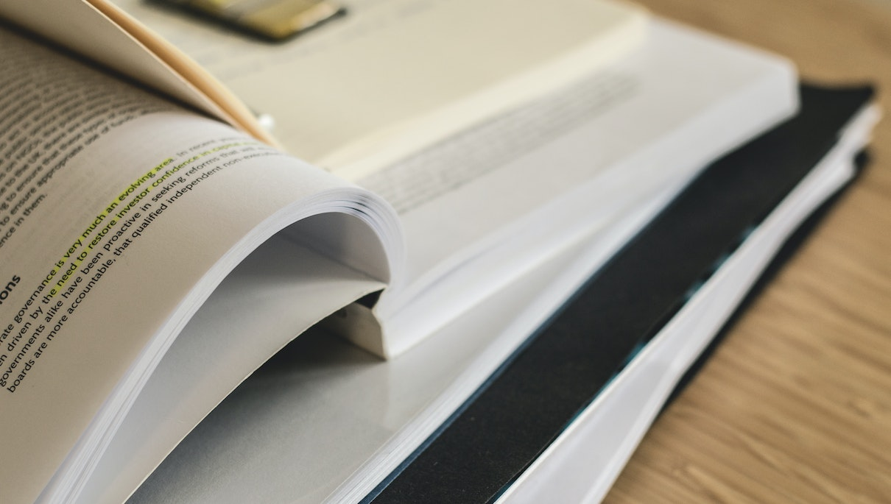

> Devido à alguns eventos canônicos da minha vida escolar, decidi estudar um pouco de pedagogia pra tentar entender melhor o lado dos meus professores e parar de reclamar tanto ou, quem sabe, continuar reclamando, mas com fundamentos. Enfim, mais um post não relacionado com tecnologia mas que eu ainda acho importante comentar sobre

A alguns dias, o penúltimo bimestre do meu ensino médio foi completo e eu comecei a pensar sobre algumas situações que me aconteceram até chegar aqui. Acho que como o próprio título sugere, não tive bons professores durante minha formação e todo esses problemas que me ocorreram fizeram-me questionar se é eu que estou sendo um mau aluno ou eles que estão sendo maus professores. O que me levou a estudar e a escrever o artigo de hoje.

Decidi pesquisar um pouco sobre pedagogia e sobre o papel do professor na sociedade, tentando entender a importância da educação; coisa que eu só aceitava que é importante, só semana passada que decidi explorar o porquê disso. Lógico que, enquanto estava estudando e refletindo, eu estava com as piores aulas que já tive em mente. Portanto, lembre-se que eu ainda sou um adolescente revoltado com a vida assim como os outros e, por isso, haverá algum viés no que irei abordar. No mais é, é isso. Estudei, anotei, refleti e repeti, e no final do dia, isso rendeu um bom conjunto de ideias e conclusões que tenho o orgulho de ter produzido; compartilhei com alguns amigos e professores, e a maioria deles concorda com minhas visões. Espero que o resultado dessas pesquisas seja relevante para você de alguma forma. Aproveite a leitura!
### Entendendo Qual É A Verdadeira Natureza Da Pedagogia?
Muitos enxergam a pedagogia como simplesmente a filosofia da educação, e isso não está errado. Apesar de ser muito pesado filosoficamente, a pedagogia é muito mais complexa do que parece e deve ser tratada e estudada com o devido respeito. É impossível conversar sobre pedagogia sem fazer perguntas “idiotas” e elementares como: O que é a verdade? É preciso saber o que é a verdade pra entender a natureza da realidade? Porque $1 + 1 = 2$? Porque esse assunto é relevante para humanidade?

A pedagogia é responsável por lidar com todo o processo de pensamento que envolva contribuir de forma positiva para os diversos âmbitos da vida humana. Ela lida com a relação entre as pessoas, fortalecendo laços e criando novos (sociologia), precisa discutir quais valores são importantes para a sociedade, o que é certo e errado (filosofia), e até quem vai pagar por toda essa instrução, afinal, tudo isso é um grande investimento de tempo e dinheiro (economia), e assim por diante. A pedagogia lida não só com as pessoas, mas também com as *experiências* que elas adquiriram e como essas experiencias podem levar nossas relações, nossas invenções, nossas ideias para o próximo nível.
### Aprendizado & O Papel Do Professor
O verdadeiro papel do educador é *guiar a experiência humana* para uma direção produtiva, tente entender isso como moldar a forma em como interagimos com a natureza, com o universo e com as pessoas. Para fazer isso, o professor precisa ter tido uma boa vida — não literalmente, claro, mas sim intelectualmente — e ter colecionado diversas experiências para serem compartilhadas, de forma que seja fácil para ele enxergar a perspectiva de outros profissionais da área e de seus próprios alunos, sua empatia precisa estar bem exercitada para cumprir com esse papel. Essa habilidade é importante porque o professor consegue entender o motivo de algum aluno sentir dificuldade com a matéria, e assim tentar trazer a informação dele de volta para a palestra, ou responder a uma pergunta difícil que alguém fez sobre algo muito específico sem dar a entender que o professor é sempre o dono da razão.

Um bom professor ensina aos seus alunos experiências valiosas, e ensina eles a cultivarem suas próprias experiências e a explorá-las de forma que leve eles a contribuírem de forma positiva para a sociedade que vivem. Os alunos aprendem por fazer, e não decorando fórmulas intermináveis, e o bom professor reconhece isso e se esforça para atingir seu objetivo; mesmo que ele não viva o bastante para ver os resultados de seus esforços.

Aprendizado é diferente de memorização, apesar de estarem relacionadas entre si. É impossível aprender um novo idioma sem decorar o significado de algumas palavras, mas é importante entender o contexto histórico do idioma pra entender os porquês do assunto, o motivo dessa palavras existir ou ter essa pronúncia; tornando mais fácil a memorização, pois o conjunto de experiências acumuladas facilitarão a conexão entre pedacinhos de conhecimento para formar uma ideia maior.

Nas aulas, um bom professor precisa sim capacitar os alunos a *sobreviverem na sociedade atual* por provir o treinamento necessário para o mesmo, seja fazendo isso por ensinar uma linguagem de programação recente ou por explicar a história das consequências culturais que os poemas de um autor do passado cometeu, a informação não precisa ser recente, precisa capacitar o estudante a ser independente e eficaz em realizar qualquer tarefa de forma eficiente na atualidade. Nessa mesma linha, o professor precisa trazer a *ordem social* na sala de aula, para que eles saibam respeitar os limites de cada membro e explorar os seus próprios limites para terem uma vida melhor quando se formarem ou completarem o curso; os ajudando a sim a criar laços sociais mais resistentes e se tornarem pessoas de confiança.

Mas todo professor ainda têm um outro dever, o mais importante de todas as profissões: *instigar a curiosidade intelectual de seus alunos*. É importante sim aprender a se comportar em sociedade e aprender matemática básica para poder conviver com os outros durante o dia a dia, porém, o mais valioso para um estudante é entender que têm muito o que aprender no futuro, e nem sempre um professor estará disponível para ensiná-lo. Durante as aulas, o professor precisa instigar o interesse dos alunos no conteúdo — independente se eles gostam ou não —, eles precisam desenvolver esse interesse de ir atrás das informas, de pensar criticamente sobre o tema, a fazer as perguntas certas para o professor ou qualquer figura de autoridade.

O que distingue um bom educador de um mal educador está muito além de seu nível de instrução. Na verdade, o que torna um educador bom é a habilidade que o mesmo tem de engajar e instigar o interesse dos alunos a respeito do tópico abordado em sala. E para isso, é importante que o próprio professor esteja atualizado com as novas ferramentas e estratégias disponíveis na sua área e que se mantenha ocupado estudando esses assuntos novos. Apesar disso, o bom professor não precisa ser um expert no assunto, mas sim ser um expert em manter a sala toda, o máximo que poder, engajada na matéria.

Por exemplo: Explicar que dois mais dois é quatro acaba sendo um processo abstrato demais para as crianças do primário, ao invés disso, talvez seja legal comentar que você (ou outro aluno na sala, é importante que seja um exemplo concreto) coma duas caixas de biscoito por dia, daí pergunte “quantas caixa eu vou comer em uma semana? 14? Excelente! Como podem ver, a matemática pode nos ajudar, em essência, a prever o futuro e nos prepara para ele portanto…”. É importante que o professor seja essa ponte entre o conceito abstrato e a aplicação prática dele na vida real; querendo ou não, todo assunto tem um motivo para estar no currículo escolar.
### O Que É Preciso Para Ensinar
Os profissionais da área da educação que se destacam fazem parecer que atuar como um professor serja uma tarefa fácil, sendo que é, na verdade, uma profissão extremamente desafiadora e complexa. Pela pedagogia lidar com tantos assuntos de caráter social e técnico ao mesmo tempo (sociologia, filosofia, economia, etc.), é fácil concluir que não exista uma característica, ou conjunto de características, objetivas que tornam um professor ruim ou bom — simplesmente não existe bala de prata. Porém, ainda assim é possível traçar algumas habilidades que todo bom professor tem em comum.

Através de seu exemplo como ser humano e cidadão, o professor precisa guiar seus alunos à uma direção produtiva socialmente. A única forma de dar esse exemplo é por ele mesmo *cultivar a curiosidade intelectual* por si mesmo, se esforçar para entender as preocupações e urgências de cada aluno e, baseado nessas *experiências*, moldar suas aulas para atender às necessidades dos alunos, mesmo que isso implique algum conflito ou esforço por parte deles. O bom professor não para de estudar essas questões, e é essencial que ele seja bastante *empático* e até otimista para continuar se motivando a melhorar todo dia, mesmo que ele não esteja vivo para colher as recompensas que seus esforços proporcionaram ao seus alunos.

***

+ [Good vs. Great Teaching: Are the best teachers born or made?](https://youtu.be/lOZgkmsyQnc)
    + Foi esse vídeo que usei como base para as minhas pesquisas. Apesar de eu não concordar com 100% com o que esse professor diz, ainda acho que vale a pena compartilhar pela tentativa de problematizar algo que a sociedade ignora a tempos, por algum motivo
