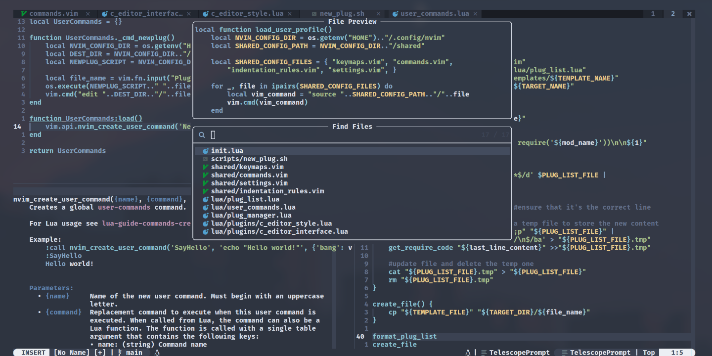

> No post de hoje, compartilho algumas experiências e ideias legais que tive enquanto estava atualizando a minha configuração do Neovim pela… Quinta vez? Pois bem, eu gosto da liberdade que esse editor me dá e acho que esse artigo pode te trazer algumas ideias de como explorar essa liberdade também. De entusiasta pra entusiasta



Olá novamente, a quanto tempo né? Sei que já passei mais tempo sem postar nada, mas esse último mês representa uma eternidade maior que o comum porque eu real tinha a intenção de me dedicar mais ao meu próprio blog. Aquela coisa de sempre, adolescente prestes a se formar, final de ano, finalmente estou começando a perceber que a vida adulta é bem caótica, com muitos deveres; Estresse esse que consumiu grande parte do meu tempo e muito da minha energia, o que me prendeu em ciclos infinitos de *doom scrolling* e procrastinação que chega a ser humilhante até de comentar. Enfim, cá estou eu, um adolescente esgotado, tentando procurar refúgio de um mundo fora do meu controle em algo tangível e customizável, dentro do meu controle.

Sei que esse contexto é meio *crinjola*, mas acho válido mencioná-lo pois muita coisa que mudei nessa minha configuração atual do meu Neovim está diretamente atrelado ao meu próprio crescimento como pessoa. Antes, gostava de ter um editor que fosse, principalmente, estiloso e atraente, já gastei horas e horas durante semanas pra atingir um nível de customização que fosse super confortável de ler, com ligaturas no terminal e tudo mais. As customizações de *keybinds* e o meu workflow no geral eram até bem que únicas, inclusive, elas não mudaram muito desde quando adotei o Vim no meu dia a dia pela primeira vez, mas elas nunca foram exatamente o foco principal; eu só queria elevar a liberdade de customização que o Vim me dá pra outro nível.

> *"The artist was attempting to make art more than something to just look at, they wanted it something to be involved in. Something too big to ignore"*

O resultado disso, foi um editor bonito, confortável aos olhos, e até divertido de usar, porém lento e não muito prático pra programação real. Quando usava o Vim puro mesmo, usava o `coc.vim` pra ter suporte a LSP, mas era muito pesado e lento pra minha batata da época, apesar de ser usável; No Neovim, eu continuei no `coc-nvim` mas depois de um tempo eu finalmente migrei pros serviços de LSP nativo do Neovim – meio que nessa questão de funcionalidade fazia as coisas correndo, só pra ter algo bonito e minimamente funcional mesmo.
## Por que ainda é válido usar o Vim em 2023
Pois bem, sim, eu uso os dois, tanto o Vim (supostamente ultrapassado) quando o Neovim. Daí eu quero tentar explicar melhor a minha perspectiva do uso dessas duas ferramentas nessa sessão do post. Mesmo me adaptando ao Neovim, depois de usar o Vim por muito tempo, não acho que o Neovim irá substituir o bom e velho Vim de nenhuma maneira. Na minha cabeça, o Vim é uma ferramenta muito mais simples e objetiva que o Neovim, no sentido de oferecer ao usuário as funcionalidades mínimas necessárias pra editar arquivos de texto com o mínimo de customização disponível; repetindo, isso comparado ao Neovim.

O Vim, pra todos os efeitos e propósitos, acaba sendo igual ao Neovim, em ambos os lados dá pra ser um desenvolvedor produtivo e customizar o editor do jeito que quiser, porém, o Neovim acaba sendo melhor pra programadores pois o suporte a linguagem Lua e aos LSPs embutidos tornam a usabilidade geral dele mais amigável pra essas situações, sendo mais fácil de se configurar e, por consequência, mais fácil de extender suas funcionalidades.

Com esse "competidor", o Vim acaba se tornando uma ferramenta menos robusta, isso se dá porquê você, como usuário, se quiser um editor de código extensível, irá optar por usar o Neovim. Mas se você é apenas um *sysadm* que só quer editar um texto aleatório no seu sistema, a quantidade massiva de *features* o que o Neovim oferece é meio desnecessário pra uma tarefa tão simples – daí que entre o Vim na jogada.

Por conta disso tudo, no meu *setup*, decidi separar o joio do trigo. Uso o Neovim pra editar código, trabalhar em projetos e afins, pois todos os meus plugins que facilitam resolver **esse tipo de problema** estão lá. Já o meu Vim, também é super customizado mas não possuí nenhum plugin e sua configuração pode ser facilmente armazenada em um único arquivo, o `~/.vimrc`, sendo muito fácil de portar esse arquivo pra `/root/.vimrc` ou pro meu Termux no celular, caso precise – essa é a principal vantagem do Vim: A portabilidade.

Com isso em mente, a principal filosofia que, agora, estou trazendo pra todas as minhas customizações é o tal do *do not repeat yourself* (em português, *não repita a si mesmo*). Portanto, é de se esperar que parte das do que se é customizado no Neovim, o antigo Vim também terá acesso à essa parte de alguma forma. E agora você está equipado e pronto pra continuar com a leitura, tendo em mente quais são os meus objetivos com cada uma dessas ferramentas.
## Dando uma olhada no código por cima
Talvez seja tarde demais pra falar isso, mas preciso dizer que este artigo **não é um tutorial**! Não espere uma lista passo a passo de como customizar o seu Neovim ou um compilado de keybinds que é obrigatório que seu editor tenha, não – tanto é que eu já espero que você já tenha uma mínima noção de Lua, Vimscript e já saiba usar, pelo menos, o Vim. O verdadeiro público alvo deste artigo é, justamente, os entusiastas da tecnologia, assim como eu, que em meio a uma vasta gama de opções de configuração não sabe ao certo o que escolher pôr no seu workflow ou nem como fazê-lo, por isso vim (trocadilho não intencional) aqui te guiar nesse processos com algumas ideias e, talvez, sugestões não tão práticas mas que podem ser úteis.
### Papel do arquivo `init.lua`
Esse arquivo é super simples e acho que dá pra mostrar ele todo aqui. A primeira dica que vou dar é pra não acumular muita coisa dentro do `init.lua` – esse arquivo não fica em `~/` igual o `.vimrc`, use e abuse dos `require`'s que o Lua te oferece –, prefiro que esse primeiro arquivo apenas importe as outras configurações do meu setup, e nada muito além disso. Mas vamos por partes, veja como esse arquivo se parece.

```lua
--- Essa função possui uma lista interna com o nome dos arquivos em Vimscript
--- que devem ser importatos; Ele usa o comando `source` do próprio Vim pra
--- carregar cada uma dessas configurações. A função assume que esses arquivos
--- estejam na pasta ~/.config/nvim/shared
local function load_user_profile()
    local NVIM_CONFIG_DIR = os.getenv("HOME").."/.config/nvim"
    local SHARED_CONFIG_PATH = NVIM_CONFIG_DIR.."/shared"

    local SHARED_CONFIG_FILES = { "keymaps.vim", "commands.vim",
        "indentation_rules.vim", "settings.vim", }
    
    for _, file in ipairs(SHARED_CONFIG_FILES) do
        local vim_command = "source "..SHARED_CONFIG_PATH.."/"..file
        vim.cmd(vim_command)
    end
end

--- Instala o gerenciador de plugins (atualmente o `lazy.nvim`) e roda o método
--- que clona os plugins e os instala em minha máquina -- bom lembrar que as
--- configurações de cada plugin estão em seus respectivos arquivos de
--- configuração (mais pra frente no post vou dar mais detalhes)
local function load_plugin_manager()
    local PlugManager = require("plug_manager")

    PlugManager.install_manager()
    PlugManager.fetch_plugins()
end

--- Outra função super simples, ela apenas imorta o arquivo que carrega os meus
--- comandos customizados -- porque o fazer uma keybind pra tudo também não é
--- lá tão conveniente
local function load_user_commands()
    local UserCommands = require("user_commands")
    UserCommands:load()
end

load_user_profile()
load_plugin_manager()
load_user_commands()

--- Nota: O legal de deixar o `init.lua` ser apenas uma lista de `require`s é
--- que eu posso simplesmente desligar uma funcionalidade que não me interesse
--- mais, por alguma razão, por comentar a linha que o arquivo chama a função
--- que faz isso. Talvez isso seja útil pra testar novas distribuições do Neovim
--- ou pra embutir keybinds e configurações de outras pessoas e desligar as
--- minhas temporariamente
---
--- E.g.:
---  this_function_will_be_called()
---  -- this_function_wont_be_called()  --commenteed
```

Acho que o grande detalhe que meio que dá pra perceber aqui, principalmente nas funções `load_plugin_manager()` e `load_user_commands()`, é que esses módulos de configuração – não sei se posso chamar assim – são objetos e o paradigma disso tudo, é meio que orientado a objetos. Tá, eu sei, não são objetos exatamente, são tabelas, é assim que são chamadas em Lua, *aff*.
### Gerando um `~/.vimrc` a partir do Neovim
É muito mais simples e trivial que parece, eu tenho um comando customizado que faz justamente isso pra mim. No arquivo `shared/commands.vim` você verá que o comando `SaveVimrc` executa o seguinte comando:

```bash
cat ~/.config/nvim/shared/*.vim | sed -e '/^ *$/d;/^".*/d' > ~/.vimrc
```

Era só isso, meio que é isso que torna o meu setup diferente da maioria, mas é simples. Esse comando usa o `cat` pra concatenar o conteúdo de todos os meus arquivos de configuração escritos em Vimscript, depois – e isso é mio desnecessário mesmo, mas prefiro assim – usa o `sed` pra limpar as linhas vazias (`/^ *$/d*`) e pra remover todos os comentários (`/^".*/d*"`) do output do `cat`, e, finalmente, ele escreve o resultado desses dois comandos no arquivo `~/.vimrc` pra mim.

É uma solução super simples e, como já mencionado, fácil de portar. Sempre que eu mudar alguma coisa nesses arquivos e quiser aplicar as minhas alterações pro Vim também, basta digitar `:SaveVimrc`, independente de qual editor, Vim ou Neovim, eu esteja usando pra isso.

Agora consigo dedicar o Vim e o Neovim pra tarefas específicas sem perder a eficiência no workflow porquê os dois estão configurados de maneiras diferentes. Não vou dar detalhes do que configurei exatamente porque você pode acessar o meu repositório do Neovim no GitHub – estará na lista de links no final do post –  a qualquer momento e ver por conta própria o que fiz, mas te garanto que 80% do que você faz com um VS Code ou Sublime Text eu consigo fazer sem problema nenhum no meu Vim minimalista sem plugin nenhum.
### Como gerencio meus plugins
Mas ninguém é de ferro, existem plugins que são uma mão na roda no meu dia a dia, o Telescope é um deles, por exemplo. Então, a partir daqui irei comentar sobre como lido com os meus plugins no Neovim, já que esse é meio que o papel dele agora, ser mais que um editor de texto avançado como o Vim e passar a ser um IDE 100% funcional e otimizada para o **meu** uso.

O arquivo com o objeto que gerencia os plugins também é simples. Como já mostrei no penúltimo tópico, esse objeto é chamado pelo `init.lua`, só dois métodos dele são chamados, pra dizer a verdade: O método que instala o `lazy.nvim` no meu setup (tirado diretamente da documentação oficial do `lazy.nvim`) e o método que instala a lista de plugins. É a esse último que quero dar um pouco mais de atenção:

```lua
function PlugManager.fetch_plugins()
    local status_ok, lazy = pcall(require, "lazy")
    if not status_ok then
        print("warn :: lazy.nvim was not installed")
        return
    end

    local plugins = require("plug_list")
    lazy.setup(plugins)
end
```

Resolvi trazer esse código porque também quero mostrar que essa verificação com o `pcall()` e a variável `status_ok` é bem recorrente no arquivo em Lua. Eu os uso, principalmente, pra importa qualquer coisa que está fora do módulo local – dentro de `lua/` –, justamente pra garantir que o require funcione corretamente e, caso contrário, o Neovim apenas mostra na tela que algo deu errado sem congelar a tela com aquela mensagem de erro irritante.

Enfim, detalhes de programaria aparte, dá pra perceber que o `lazy.setup()` tá importando a lista de instalação de outro arquivo, vamos pra ele agora.
#### Listas de plugins instalados
Aqui vale comentar um erro – ou não – que eu estava cometendo. No passado, eu tinha um costume de, nessa parte do gerenciamento de plugins, escrever uma função em Lua que fazia o seguinte pra mim:
1. Usava o comando `ls -1` no meu sistema pra listar uma pasta com os arquivos de configuração de cada plugin;
2. Pra cada linha, ele formava uma string que fosse compatível com a função `require` do Lua – por exemplo, convertia `lua/plugins/telescope.lua` pra `plugins.telescope`;
3. Depois ele gerava uma tabela com a lista de plugins e suas respectivas configurações que fosse compatível com o `packer.nvim`, gerenciador que eu usava na época;
4. E, finalmente, passava essa tabela pra função que instalava os plugins

Sei que é muita lógica desnecessária, mas isso facilitava muito a minha vida quando queria testar algum plugin novo. Bastava eu criar um arquivo novo na pasta com a lista de plugins, e na próxima vez que eu fosse abrir o Neovim ele já estava funcionando.

É até legal e diferente ter uma config assim, mas o problema é que, na maior parte do tempo, o meu Neovim demorava uns segundos pra abrir, e isso me incomodava muito. Portanto, decidi adotar uma estratégia diferente, mais objetiva pro assunto. Agora o arquivo que gera a tabela com a lista de plugins pro `lazy.nvim` instalar importa os plugins um por um, manualmente:

```lua
local plug_list = {}

--- Esses plugins não têm configuração, então eu simplesmente os deixei
--- nesse arquivo mesmo...
table.insert(plug_list, "kyazdani42/nvim-web-devicons")
table.insert(plug_list, "tpope/vim-surround")

--- Os plugins aqui em baixo estão na pasta `lua/plugins/`
table.insert(plug_list, require('plugins.p_emmet'))
table.insert(plug_list, require('plugins.c_editor_style'))
table.insert(plug_list, require('plugins.c_editor_interface'))
table.insert(plug_list, require('plugins.p_telescope'))
table.insert(plug_list, require('plugins.c_code_helpers'))
table.insert(plug_list, require('plugins.p_cmp'))
table.insert(plug_list, require('plugins.c_code_lspconfig'))

return plug_list
```

Dava pra eu ter retornado só uma tabela com a lista de plugins pro `lazy.nvim` instalar, mas têm uma razão de eu ter usado essa quantidade de `table.insert()`. Já já irei esclarecer isso, *guenta* ai…

Continuando: Eu não sei exatamente o porquê o meu Neovim estava demorando tanto pra abrir – claramente, ainda sou um amador –, mas o problema se resolveu quando me livrei dos laços de repetição. Tenho a teoria de que o Neovim, na minha máquina antiga, não conseguia lidar com tanta tarefa assim, não sei o quão pesado é essa operação de executar um comando no meu sistema operacional e pegar as linhas do output desse comando, nem como a própria linguagem compila um laço de repetição. Mas o problema se resolveu, e é isso que importa.
#### Adicionando plugins novos
Eu abandonei a minha estratégia antiga de fuçar no *file system* da minha máquina, mas não abandonei a ideia de inserir novos plugins com facilidade. Eu escolhi formatar a minha lista de plugins daquele jeito porque agora eu tenho um script separado que faz o que o meu Neovim fazia:
1. Dado um nome para o arquivo, especificado pelo usuário, esse script copia o conteúdo de um template, em `templates/p_plugin.lua` e cola na pasta com os plugins, renomeando-o com o nome que o usuário especificou;
2. Depois disso, ele executa a rotina que atualiza o arquivo com a lista de `require`'s pra importar o arquivo novo que acabei de criar:
	1. Formata a string do nome do arquivo pra ser uma string que o `require` consiga usar e a salva numa variável;
	2. Salva o conteúdo das últimas linhas do arquivo com a lista de plugins – to falando do `return plug_list` – numa variável também e deleta essas linhas do arquivo;
	3. Baseado na string compatível com o `require`, ele gera uma string de um código em Lua que importa o módulo com o `require` e adiciona o retorno desse módulo à lista de plugins;
	4. Finalmente, ele reescreve as últimas linhas que ele tirou do arquivo.

Esse script tirou o peso que o Neovim tinha de fuçar no meu file system, mas ainda é um tanto desnecessário na questão prática, talvez se todos os meus plugins estivessem num arquivo só seria mais rápido de adicionar ou remover as coisas. Mas assim… Convenhamos, não haveria graça nenhuma. Isso foi particularmente mais divertido pra mim porque usei bastante *regex*, com uma ajudinha do `sed` pra isso – nessa brincadeira aprendi como o `sed` é real uma ferramenta muito poderosa e como saber manipular texto é uma habilidade que pode vir a calhar algum dia no futuro.
### Comandos customizados
Apesar desse script ser bastante prático esse processo todo pode ficar ainda mais confortável de executar. Por conta disso, escrevi um comando customizado que executa esse script pra direto do Neovim, ou seja, eu posso simplesmente digitar `:NewPlug` que um prompt vai aparecer perguntando o nome do arquivo, depois do *enter* o editor me poupa do trabalho de procurar pelo arquivo manualmente e já o abre pra mim num novo *buffer*.

Fazer isso não é complicado e é até melhor que passar muito tempo criando o *set* de keybinds perfeita. Eu parto do princípio que se é uma tarefa que eu executo com frequência, mas não todo dia, essa tarefa vira um comando no Neovim e não uma *mapping* nova. Enfim, eu disse que esse post não era um tutorial, mas vale mostrar aqui um snippet que talvez seja útil pra você:

```lua
vim.api.nvim_create_user_command('NomeDoComando', function()
    -- O corpo do seu comando vai aqui
end, {})
```

Super simples, mas é extramente extensível. Vale a pena dar uma lida no `:h nvim_create_user_command` pra se aprofundar um pouco.
## Epílogo
Eu acabei de migrar da minha config antiga pra essa atual a alguns dias só, e eu acho que teve algumas lições que pude tirar disso tudo. Primeiro de tudo, depois que apaguei e reescrevi (quase) tudo de novo, perdi um final de semana só – o que é um avanço comparado com as outras vezes –, e por ter sido tão rápido, percebi que o degrau pra ter um editor confortável e ser produtivo de fato não deve ser tão alto. Dá pra ficar satisfeito com pouco, e olha que eu sou frescurento com tudo.

Outra coisa, planejamento é tudo, mas não te leva a lugar nenhum sem ação. Nesses dois dias de configuração, no segundo eu desisti de 30% do que estava fazendo, criei uma *branch* nova pra testar a nova solução e me aderi a ela depois que vi que era promissora, foi o que me levou a criar esse script maluco.

Foi divertido, faria de novo, mas a vida é curta.

Dei a entender que cheguei no final, mas nunca tem um final de fato. Vou ir adicionando plugins e configurações extras a medida que vou precisando. Se algo me impedir de usar o Neovim, o Vim é tão confortável de usar quanto, e sempre estará a minha disposição agora. Vou compartilhar alguns materiais que encontrei por ai no YouTube – maioria enquanto amoçava – pra esse post não ser somente sobre mim, caso você seja entusiasta no assunto também, sei que vai gostar, mas espero que seja útil pra todo mundo.

Mas e você? O que você acha do editor? Quais experiências você têm com o Neovim? Como você o utiliza ou não? Quais plugins e keymaps você usa? Não deixe de deixar um comentário, ficarei feliz em lê-lo. No mais é isso; criticas, sugestões pra novos artigos e, principalmente, correções sempre serão bem-vindas. Até!

***

+ [Meu setup do Neovim](https://github.com/kevinmarquesp/me_Neovim)
    + Aqui está a minha configuração atual do Neovim, caso esteja interessado em ver como apliquei na prática o que trouxe para esse artigo
+ [TJ DeVries](https://www.youtube.com/@teej_dv)
    + Esse cara é um dos contribuidores do Neovim, e ele realmente leva as funcionalidades do Neovim a outro nível. Teve um dia que ele criou uma função em Lua que rodava os testes de um projeto sempre que ele detectava uma mudança em um dos buffers, e mostra o resultado num buffer também
+ [ThePrimeagen](https://www.youtube.com/@ThePrimeagen)
    + Esse cara é divertido, ele é só um grande evangelista do Neovim. Mas ainda assim vale fuçar no canal dele porque ele pode ter dar um insights muito interessantes de como você deve encarar o seu editor de código, dicas de keymaps e configurações também você pode encontrar aqui
