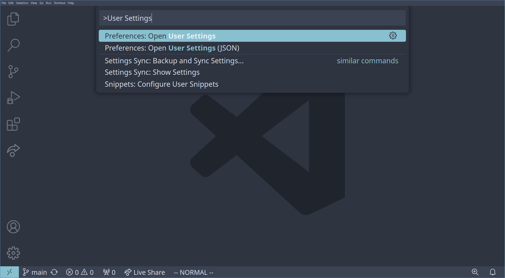
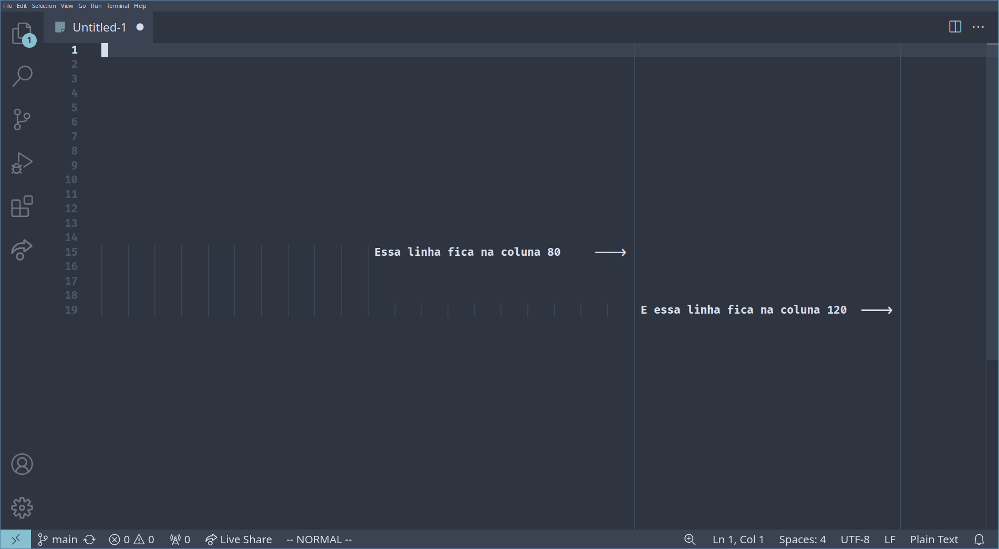
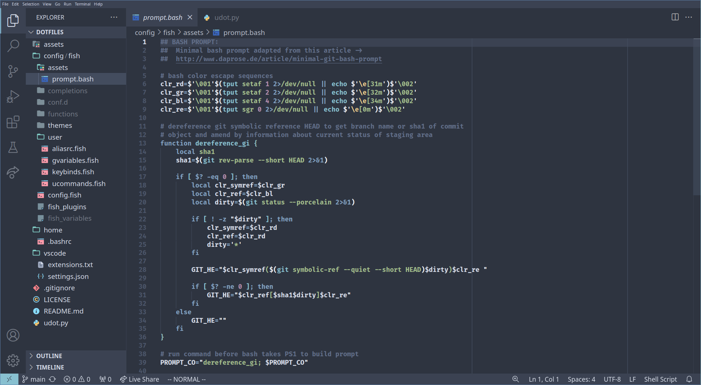

# Bora Conversar Sobre O VS Code
Pra quem pensou que eu fosse parar de escrever artigos em português, cá estou eu novamente. Recentemente eu estive brincando um pouco com o Github Codespaces pra entender melhor essa *feature*, recomendei pra uma amiga e tentamos fazer *pair programming*[^1] só usando o navegador, ela num Codespace e eu usando o [vscode.dev](https://vscode.dev/) – a experiência foi um sólido "*meh…*", mas é totalmente usável caso você esteja longe do seu computador ou têm uma máquina terrivelmente fraca. Daí chega hoje.

[^1]: Caso você não esteja ligado, *pair programming* é literalmente programar de parzinho. Você chama um amigo/colega pra editar o mesmo código ao mesmo tempo – ou com um de vocês só monitorando – daí vocês podem discutir ideas de implementação, um escrever os testes enquanto o outro mexe no  *source*, esse tipo de coisa.

Decidi ao menos deixar o VS Code já instalado e configurado na minha máquina case eu precise compartilhar meu código com algum time ou amigos no futuro, é mais fácil de fazer isso nele. Dediquei meia horinha da minha vida pra configurar tudo do jeito que eu quero (coisa que eu irei discutir mais pra frente nesse artigo) e pinto a idea de ler [um artigo](https://foxtechworld.github.io/posts/meu-vscode-minimalista/) de um amigo meu durante o almoço, o que me inspirou a escrever esse post (obrigado de antemão KitsuneSemCalda) – aproveitando pra fazer a *publi*, você pode ver os outros posts dele [aqui](https://foxtechworld.github.io/posts/).

No artigo desse *brother*, ele compartilha as configs dele e comenta bastante sobre o "o quê" do assunto, quero pegar essa ideia dele e ~~encher linguiça~~ abordar uns tópicos mais diferenciados, que não vejo muito fora da *gringa*; Hoje eu quer compartilhar minha mais recente configuração também e explicar o "porquê" você também deve se preocupar em um setup do VS Code também.
## As Vantagens Do VS Code
Antes de mais nada, acho que é bom deixar claro que eu não sou evangelista de nada,– muito menos de tecnologia –, apenas aproveito meu tempo customizando/personalizando uma ferramenta que está a minha disposição. Esclarecidos? Esclarecidos.

O VS Code é literalmente o tipo de coisa que so beneficia àqueles que têm condições de usá-lo, ele é muito pesado, bem mais que você imagina e bem mais do que precisa, não vou mentir. Mas o que me levou a instalar essa IDE mais uma vez foi o fato de que ela é simplesmente conveniente, o famoso "*it just works*".

O que faz total sentido, considerando que ele é escrito em Javascript. Pesado e lento? Sim. Mas é uma linguagem fácil, o que permite, praticamente, qualquer pessoa a criar um plugin ou uma extensão nova pra ele. Além do que, ele meio que foi feito pra ser usado por desenvolvedores *front-end*, e ele é realmente muito bom nisso.
### A Questão Da Produtividade
Bem, eu só baixei e configurei o VS Code pela última vez porque eu gosto de ter um editor alternativo, já que agora eu posso – os meus PCs sempre foram fracos, o primeiro que tive tinha só 2 GB de RAM e o segundo 3, é a primeira vez na minha vida que tenho uma máquina com 8 GB de RAM –, e, justamente, pra facilitar no trabalho em equipe. Em resumo, só tenho ele porque (quase) todo mundo usa.

Mas não me entenda mal, posso ter gastado mais horas usando o Vim do que dormindo, mas não acho que seja impossível de ter uma vida ergonômica e saudável só com o VS Code. Na real, ele é tão customizável quanto o Vim e não vejo muita gente falando disso, e olha que eu não estou falando de plugins.

Você pode criar seus próprios atalhos nas configurações, mudar a aparência do seu editor, trocar de fonte, etc. Mas o que eu acho mais interessante é a *Command Pallet* que, pra todos os efeitos e propósitos, é basicamente o mesmo que a linha de comando do Vim, quando você aperta `:`.  Nessa *Command Pallet* tu pode fazer tudo que você precisa, e pesquisar pelas opções com o teclado. Tanto é que o *workflow* ideal seria usar bastante os comandos de *Ctrl + P* pra procurar e abrir um arquivo, *Ctrl + Shift + P* pra fazer tarefas mais complexas e *Ctrl + J* pra abrir o terminal integrado à IDE.

> Pro Tip: Se você está usando um notebook como eu, experimente manter os dedos nas teclas de descanso do seu teclado e controle o mouse pelo mouse pad usando um dos seus polegares. Nunca é bom você tirar a mão do teclado pra por a mão no mouse toda hora, vai por mim, tendinite não é brincadeira não…

Ainda sobre essa *Command Pallet*, ela te dá um dos comandos mais úteis da IDE que uma opção pra você criar os seus próprios *snippets* de código[^1]. É super legal e pode ser útil pra alguns, eu, particularmente, nunca precisei usar.

[^1]: Abra a *Command Pallet* com *Ctrl + Shift + P* e pesquise por *Snippets: Configure User Snippets*, vale a pena experimentar caso você não tenha tentado.
## Eu Ainda Prefiro Usar o Vim
Eu dei uma puxada de saco braba no VS Code ali, mas acho que realmente nada vai superar o meu *workflow* usando o Neovim, acho até que em alguns casos prefiro usar o Vim puro pra editar algumas coisas do que o VS Code propriamente dito.

Se você não conhece ou não acha que valha o seu tempo, experimenta, sério mesmo. Acho que eu acabo achando melhor o Vim porque ele se integra muito bem com as minhas outras ferramentas (Fish, Tmux, Tmuxifier, St, i3wm…) – Inclusive, eu ainda estou devendo um post sobre todo o meu ambiente de desenvolvimento, eu me divirto muito trabalhando nos meus projetinhos nele. Digo isso na questão de que, diferente do VS Code, são várias ferramentas diferentes que **eu** configurei pra **eu** usar, ele não é tão *general purpose* igual o VS Code.

Mas o VS Code têm o seu mérito, por isso estou dizendo gastando tanto tempo falando disso. Não só use a ferramenta certa, explore a ferramenta explore ela e compara com as outras ferramentas que você já sabe, daí troque de ferramenta caso uma alternativa pareça melhor.
## Começando Do Zero Absoluto
Ok, agora vou compartilhar o meu setup de fato. Eu instalei o meu querido Arch Linux (com suporte a *snapshots* e *encriptação*, diga-se de passagem) e eu queria cria o meu setup definitivo do VS Code. O objetivo aqui é que seja simples e direto ao ponto, sem *snippets* ou rotinas customizadas – nem sei se fez sentido isso, mas imagino que exista algo assim –, se eu trocar de máquina ou de OS de novo, quero que o processo de configuração seja simples.

Felizmente, assim como o Vim ou qualquer outra ferramenta de desenvolvimento que se preze, o VS Code guarda todas as configurações do usuário dentro de um arquivo – na verdade mais, mas é só de um que preciso. Se você não sabia disso, as opções de configurações que você muda pela *Command Palled* (pra trocar de tema, por exemplo) ou as caixinhas que você marca ou campos que você muda no menú de *Preferências* ficam salvas em um arquivo JSON.

O que é ótimo, porque você sequer precisa abrir o painel de *Preferências* pra fazer suas customizações, você pode ir escrevendo direto nesse arquivo JSON como eu fiz, ou você pode copiar a configuração de outra pessoa e colar no seu arquivo de configuração, assim você têm as mesmas customizações da pessoa que você copiou. Esse arquivo fica em `~/.config/Code/User/settings.json` no Linux ou em `%APPDATA%\Code\User\settings.json` no Windows – não, eu não lembro qual é o valor da variável `%APPDATA%`, desculpa –, mas você pode pesquisar por esse arquivo direto do VS Code através da *Command Pallet*.



Dito isso, já posso começar com o básico do básico.
### Configurações Gerais Do Editor
Aquela coisa, se você já está familiarizado com o VS Code isso aqui é o feijão com arroz pra você, mas vale explicar o que cada linha faz pros meus queridos amigos iniciantes. Começando com o "quase inútil": Essa opção `editor.rulers` desenha uma linha vertical pra cada número nessa lista, essas linhas são úteis pra você saber mais ou menos o quão longo está sendo as suas linhas, eu tento me limitar a escrever linhas com menos de 80 caracteres, e evito escrever linhas com mais de 120 caracteres o máximo possível. Torna o meu código um pouco mais legível, principalmente pras janelas pequenas.

Sobre o `editor.tabSize`, bem… Por padrão ele já usa 4 espaços pra tabulação, mas eu deixei explicito porque tem dias que me dá na telha de usar 2 espaço, 3 quando estou programando em Lua (esquisito né?) e as vezes 8 pros níveis de tabulação ficarem mais visíveis. Cada numeração têm seu propósito e vai depender da linguagem e do estilo de escrita que o pessoal costuma usar pra ela, mas eu costumo manter no 4 mesmo normalmente – eu sei que dá pra mudar, mas a mudança só é aplicada por arquivo, e as vezes que manter o mesmo padrão no projeto todo.

```json
"editor.rulers": [80, 120],
"editor.tabSize": 4,
```



Esse aqui também é bem direto ao ponto, mas ainda dá pra discutir uma coisa ou outra. Na primeira linha eu adiciono a fonte [Fira Code](https://github.com/tonsky/FiraCode)à minha lista de fontes disponíveis, é importante que você só adicione no começo da lista porque o VS Code vai usar a próxima fonte caso essa não esteja disponível, depois a próxima se essa também não estiver e assim por diante. Deixei a fonte como negrito, isso facilita um pouco pra eu entender melhor o que está escrito, porquê eu tenho o costume de deixar a letra bem pequenininha e com o zoom já baixo, assim eu posso ter mais informação *per* monitor; Tenho visão boa, uso e abuso dessa questão.

E essas ligaturas que deixei ativada são uma *feature* da fonte que eu estou usando, ela substitui os glifos de alguns caracteres quando eles estão em conjunto. No print anterior, essas setinhas foram desenhadas com algo do tipo `---->`, daí o próprio editor já desenha pra mim. Você pode ver as ligaturas disponíveis no repositório oficial da  fonte, alguns não acham necessário, e realmente nem é mesmo, só uso pelo estilo e acho mais confortável de ler o símbolo de *menor ou igual* do que `<=` em alguns casos, vale a pena experimentar caso você já não conheça a fonte.

```json
"editor.fontFamily": "'FiraCode Nerd Font', 'Droid Sans Mono', 'monospace', monospace",
"editor.fontWeight": "bold",
"editor.fontSize": 12,
"editor.fontLigatures": true,
```

E, por fim, a minha configuração do terminal integrado. Essa é bem diferenciada porque eu me esforcei um pouco pra deixar o meu *workflow* no VS Code parecido com o meu no Tmux + Vim. Por padrão, o VS Code abre/fecha o terminal com o atalho *Ctrl + J*, mesmo que você esteja com o cursor no terminal, mesma coisa com o *Ctrl + P* pra abrir o *Quick Search*, e, pra piorar, o VS Code desabilita qualquer outra combinação no teclado; Por exemplo, o *Ctrl + K*, que não faz absolutamente nada no terminal, é bloqueado e não vai parar o shell que estou rodando no momento.

Sei que parece frescura, mas o "problema" é que sou muito dependente do terminal, eu gosto de usar o comando *Ctrl + P* pra voltar ao comando anterior no Bash ou entrar no modo de inserção no Fish, eu gosto de usar o *Ctrl + K* e o *Ctrl + J* pra subir e descer no menu do FZF, além do que, eu ainda uso Vim pra algumas coisas no terminal, mesmo dentro do VS Code, então eu preciso que esse terminal integrado da IDE respeite isso e haja como se fosse um emulador de terminal qualquer numa janela separada.

Essas linhas só setam Fish[^1] como o meu shell principal pro VS Code e desabilita esse comportamento estranho de algumas combinações de teclas não funcionarem. Só isso.

[^1]: O que é um tópico totalmente discutível, o Fish não deve ser o shell principal do seu usuário em nenhuma hipótese, o ideal seria que você configurasse todos os seus emuladores de terminal para abrir o Fish por padrão. Permaneça no Bash pra evitar problemas de compatibilidade, já que o fish não é nenhum *superset* do Bash como Zshell, ele é uma linguagem totalmente diferente e, portanto, se algum script precisar executar alguma coisa no seu shell principal, é provável que dê erro nessa brincadeira porque é comum que esse tipo de script espere que você esteja usando alguma coisa derivada do antigo *Bourne Shell*. [Esse brother](https://superuser.com/questions/1316715/why-is-it-not-recommended-to-set-the-default-shell-of-the-root-user-to-a-non-pos) explica melhor sobre o assunto.

```json
"terminal.integrated.defaultProfile.linux": "fish",
"terminal.integrated.allowChords": false,
"terminal.integrated.commandsToSkipShell": ["-workbench.action.quickOpen"],
```

E isso concluí o meu setup básico, talvez até tenha gente que consiga viver somente com isso, mas eu ainda preciso de mais algumas coisinhas pro VS Code se tornar usável…
### Adicionando Plugins Á Essa Bagunça
Então, os meus plugins só mudam o visual do VS Code, como você já deve ter percebido nos prints anteriores. Pro tema, eu escolhi a paleta de cores [Nord](https://www.nordtheme.com/) – eu a uso faz uns bons anos e gosto de usar esse tema em todo lugar, não sei como eu não enjoei até agora –, ela tem um *look* profissional e escuto gente falando que acha esse tema mais confortável de ler, coisa que eu, honestamente, não estou nem ai, a paleta é **estilosa**, ponto. Têm várias variações dessa paleta que combinariam com o meu *rice*[^1], eu escolhi a mais genérica: [`arcticicestudio.nord-visual-studio-code`](https://marketplace.visualstudio.com/items?itemName=arcticicestudio.nord-visual-studio-code).

[^1]: Então. *rice* é um termo na comunidade de Linux que significa, simplesmente, o setup visual do meu sistema, considerando que qualquer distribuição Linux é terrivelmente customizável.

Além da paleta, eu também adicionei um tema para os ícones que aparecem na *File Tree* aqui na lateral do editor. Não é nada essencial, é outra coisa que só adicionei pela estética também, pra perder um pouquinho de tempo e etc. Eu usei o [Material Icon]( https://marketplace.visualstudio.com/items?itemName=PKief.material-icon-theme) por muito tempo, mas dessa vez eu decidi experimentar o [Material Theme Icons](https://marketplace.visualstudio.com/items?itemName=Equinusocio.vsc-material-theme-icons), acho que ele combina um pouco mais com a paleta que estou usando, e os ícones realmente parecem mais bonitinhos.

No final, vou ter um editor com essa aparência agradável (pra mim, *of course*):



Mas nem só de aparência vive o homem, eu tenho duas extensões que são importantíssimas pra mim. Uma delas é o [Live Share](https://marketplace.visualstudio.com/items?itemName=MS-vsliveshare.vsliveshare), que eu uso pra facilitar o pair programming, sem ela eu não conseguiria criar sessões compartilhadas do VS Code e só conseguiria participar nessas sessões usando o VS Code do navegador (ninguém merece isso).

Agora a outra, *oh boy*, é simplesmente perfeita e é a extensão que torna o VS Code uma alternativa que eu posso usar pra desenvolver minhas aplicações quando me der na telha – tipo, não preciso me prender ao terminal o tempo todo, agora que meu computador roda o VS Code bem eu posso usar ele quando eu tiver com vontade (trabalhar pelo terminal ainda é melhor, apenas aceite). Essa extensão é o famoso [Vim](https://marketplace.visualstudio.com/items?itemName=vscodevim.vim), um emulador da interface do Vim, *gotta go fast baby*.

Agora meu editor tem os *Normal*, *Insertion*, *Visual*/*Visualblock* e *Selection Modes* do Vim, consigo navegar com as teclas *H*, *J*, *K* e *L*, e consigo copiar as coisas com o *Y* pelo mono normal. Mas a vantagem dele é que ele também é customizável, então eu posso trazer os meus mapeamentos customizados do meu `~/.vimrc` pro `settings.json` – obviamente, traduzindo o Vimscript pro formato que a extensão entende em JSON – e aproveitar o meu *workflow* com, praticamente, zero de atrito nessa migração. Por isso eu estou dizendo, se me der na telha de usar o VS Code a qualquer momento eu posso agora.

No final do dia, o meu `settings.json` vai ter, agora, qual paleta de cores e tema de ícones eu vou usar:

```json
"workbench.iconTheme": "eq-material-theme-icons-light",
"workbench.colorTheme": "Nord",
```

E, depois que eu migrei meu `~/.vimrc`, as configurações do emulador de Vim vai ter esse visual no arquivo – não precisa se esforçar pra entender, a única *feature* que vale a pena comentar é o fato da *clipboard* do meu sistema ser compartilhada com esse emulador, então o *Y* copia pra minha *clipboard* e o *P* cola da minha *clipboard*, gosto de manter isso compartilhado entre o Vim e o meu sistema, o meu Neovim também tem o mesmo comportamento:

```json
"vim.useSystemClipboard": true,
"vim.leader": "<space>",
"vim.insertModeKeyBindings": [{ "before": ["<c-l>"], "after": ["<esc>"] }],
"vim.visualModeKeyBindings": [{ "before": ["<c-l>"], "after": ["<esc>"] }],
"vim.normalModeKeyBindings": [
	{ "before": ["Y"], "after": ["y", "g", "$"] },
	{ "before": ["n"], "after": ["n", "z", "z", ""] },
	{ "before": ["N"], "after": ["N", "z", "z", ""] },
	{ "before": ["<leader>", "h"], "after": ["<c-w>", "h"] },
	{ "before": ["<leader>", "j"], "after": ["<c-w>", "j"] },
	{ "before": ["<leader>", "k"], "after": ["<c-w>", "k"] },
	{ "before": ["<leader>", "l"], "after": ["<c-w>", "l"] },
	{ "before": ["<leader>", "<leader>"], "after": ["@"] },
	{ "before": ["<leader>", "."], "after": ["A", ".", "<esc>"] },
	{ "before": ["<leader>", ","], "after": ["A", ",", "<esc>"] },
	{ "before": ["<leader>", ";"], "after": ["A", ";", "<esc>"] },
	{ "before": ["<leader>", ":"], "after": ["A", ":", "<esc>"] },
	{ "before": ["<leader>", "q"], "commands": [":q"] },
	{ "before": ["<leader>", "Q"], "commands": [":qa!"] },
	{ "before": ["<tab>"], "commands": [":bn"] },
	{ "before": ["<s-tab>"], "commands": [":bp"] },
	{ "before": ["<leader>", "i"], "commands": [":vsplit"] },
	{ "before": ["<leader>", "s"], "commands": [":split"] },
	{ "before": ["<leader>", "t"], "commands": ["workbench.action.terminal.toggleTerminal"] },
	{ "before": ["<c-p>"], "commands": ["workbench.action.quickOpen"] }
]
```

> Fazer essa migração não é tão difícil quanto parece, eu recomendo você o próprio recurso de gravar macros do Vim – ou do emulador mesmo pelo VS Code – pra automatizar as modificações que você precisa fazer em cada linha, me levou uns 15 minutos pra fazer isso, e ainda pesquisando como o JSON precisava ficar pra atingir o comportamento que eu quero.

Uma nota importante, caso você queira usar esse plugin e já usa o Vim a um tempo, não é toda *mapping* que funciona aqui. Tenha isso em mente enquanto você configura e testa o seu *setup*.

Sobre os outros *plugins*, os que são mais específicos pra linguagens ou ferramentas, eu vou ir baixando a medida que eu preciso ou a medida que eu preciso. O VS Code ainda se dá ao trabalho de detectar a linguagem do arquivo aberto e recomenda que eu instale uma extensão pra ela, caso eu não tenha, isso facilita bastante.
## Tenho Um Backup Disso Tudo
Como ja disse, não é a primeira vez que uso o VS Code. E sempre que instalo ele de novo, tenho que sair pesquisando como adicionar essas *keybinds* ao emulador do Vim, baixar um tema pra IDE e pros ícones agradável, etc. Mas já estou cansado disso, hoje vou fazer o que deveria ter feito a anos atrás: botar o `settings.json` na minha coleção de *dotfiles*.

Esses *dotfiles* – arquivos de configurações das ferramentas que eu uso, caso não saiba – ficam guardadinhos no meu Github nesse [repositório](https://github.com/kevinmarquesp/.dotfiles/). Ele não está completo ainda, preciso colocar as outras ferramentas e escrever uns scripts pra automatizar o processo de copiar/*linkar* esses arquivos de configuração pros destinos de cada um, ainda tô pensando em como vou organizar isso tudo, mas isso é material pra outro post.

Como o VS Code é uma aplicação *cross platform*, eu dediquei uma pastinha especial para os arquivos de configuração dele, no caso, só o `settings.json`. Daí, dependendo do sistema, eu posso só copiar esse arquivo pra pasta onde ficaria ou criar um link simbólico pra isso. Mas isso não instala as minhas extensões, e o VS Code não tem um jeito muito fácil de fazer isso pro usuário, ao menos é o que eu acho, porque o arquivo de configuração dos plugins têm muita informação que é única para o sistema operacional. Isso não é problema nenhum na verdade, eu tenho uma solução até que boa pra isso.

Nos meus *dotfiles* eu tenho um arquivo chamado `extensions.txt`, ele é a lista de das extensões que eu quero que sejam pré-instaladas. Daí eu uso e abuso do comando `code` do VS Code. Ele faz bem mais que abrir a IDE num arquivo ou numa pasta pra você, também dá pra instalar uma extensão nele com `code --install-extension [ID_DA_EXTENSÃO]` – Esse ID você pode encontrar na própria lojinha de extensões, na direita –, ou seja, pra eu instalar todas as extensões desse arquivo de forma automática, eu posso usar um comando como `cat extensions.txt | xargs -I{} -P12 bash -c 'code --force --install-extension {}'`[^1] – E sim, eu preciso usar o `xargs` ou alguma ferramenta similar pra isso porque esse comando pra instalar uma extensão realmente faz isso: instala **uma** extensão, ao menos eu posso aproveitar pra passar a opção `-P12` pra ele usar 12 núcleos da minha CPU pra instalar tudo, é mais rápido.

[^1]: Você pode ter mais informação sobre o que o `code` faz com o comando `code --help`, mas só pra complementar esse artigo, essa opção `--force` atualiza a extensão caso ela já esteja instalada. Normalmente o `code` interrompe o comando de instalação se a extensão já estiver sido adicionada pelo usuário. Enfim.

No caso do Windows, acho que até é mais fácil de entender o comando, estou meio enferrujado com o Powershell, mas imagino que eu precisaria rodar algo como `cat extensions.txt | % { code --force --install-extension $_ }`. Eu tenho um [post](https://kevinmarquesp.github.io/archive/240301-1118_primeiras-impressoes-com-o-powershell/) sobre Powershell aqui também, caso você esteja interessado em detalhes, também acho que estou precisando reler esse artigo e praticar um pouco pra passar o tempo e não ficar tão desatualizado.

É super fácil de manter esse arquivo atualizado, caso esteja se perguntando. Não preciso ficar pesquisando pela extensão na *Market Place* e copiar e colar o ID de cada uma manualmente, o comando `code --lisst-extensions` me dá tudo que preciso, basta redirecionar o *output* desse comando para o arquivo em questão com `code --list-extensions > extensions.txt` e pronto, tanto no Windows como aqui no Arch.
### Você Também Deveria Guardar Sua Config.
Já disse isso, mas torno a repetir: é muito mais conveniente já ter tudo pré-configurado e só copiar e colar os arquivos de configuração nos *paths* certos caso você troque de sistema operacional com uma certa frequência, ou têm vários computadores. Mas mesmo que você não planeje experimentar  um ambiente virtual diferente do seu Windows 11, ainda é importante que essa config seja de fácil acesso. *Let me explain*.

A medida que a tecnologia evolui, os usuários vão acabar preferindo usar ferramentas que dê pra acessar direto do navegador – é ruim porque depende de internet, mas é bom porque não precisa baixar nada –, e o mesmo está acontecendo no mundo de desenvolvimento; Até agora, o VS Code é o único editor (que eu conheço) que é possível usar direto do *browser* num site, o *Github Codespaces* é a prova viva disso, dá pra fazer tudo que você normalmente faria na sua máquina num *container* dentro de uma *máquina virtual* num servidor externo.

Não me entenda mal, essa questão de editar código pela nuvem não vai substituir o desenvolvimento local de forma nenhuma, só acredito que é uma conveniencia que vai ajudar muita gente que precisa concertar um bug crítico nas férias e está longe do computador; Essa pessoa hipotética poderia pegar o notebook emprestado de algum amigo e trabalhar normalmente. Além dos casos de quem têm realmente uma máquina fraca e quer brincar com Docker e coisa assim, mas não tem o hardware pra fazer isso sem o PC explodir.

A ideia é que, caso você tenha um backup, ou um script que puxa o seu backup de algum lugar da internet, você conseguirá ter o exato mesmo *workflow* que você teria na sua máquina local com o VS Code num VS Code web, pelo navegador.
## Epílogo
Wow, foi muita enrolação só pra dizer que meu VS Code é bonito, usa um emulador de Vim e que o `settings.json` é público. Mas achei que seria interessante compartilhar um pouco da minha experiência com o editor e o pensamento por trás de algumas das minhas decisões de customização – mesmo gastando mais de 4 mil palavras pra isso.

Enfim, é isso. Eu estou curioso pra saber como vocês usam o VS Code também, acho que todo mundo tem algum detalhe legal de customização valha a pena compartilhar. E o que você acha dessa questão do Github Codespaces e sobre programar em *cloud*? O que você pensa da segurança ou privacidade disso? Você também acha que é legal existir mas também não é bom ficar dependente disso? Divida suas ideias com o pessoal nos comentários, sempre é bom.

E, aliás, não deixe de comentar sobre o que tu achou do post, to começando a escrever com pouca pesquisa de suporte pra alguns posts ficarem com uma cara mais de conversa, e acho que é até melhor me expressar assim, mas não sei. Está muito longo ou não têm muito problema nesses casos? Dá um *feed-back* ai, tenho muito o que melhorar.

No mais, é isso mesmo. Obrigado pela atenção! ❤️
