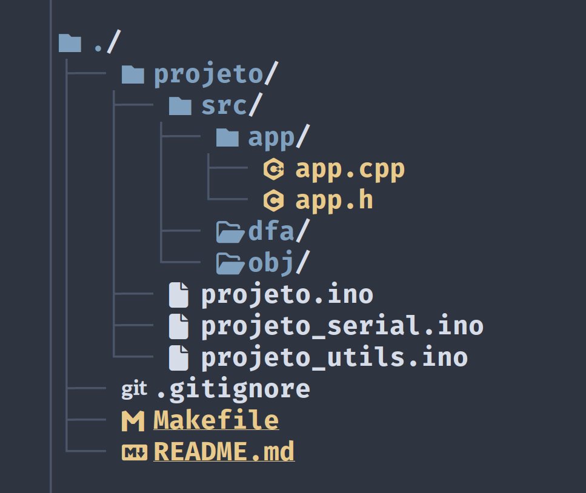

Hoje a ideia desse artigo é ser curto mesmo, isso porque eu só quero
compartilhar uma coisa que aconteceu comigo hoje e me deixou até que bem
feliz. Eu estive arrumando o meu quarto e me deparei com o meu Arduino *Xing
Ling* acumulando poeira na minha gaveta de eletrônicos, ai lembrei de um
projeto antigo que já cheguei a fazer nele -- um relógio Pomodoro[^pomodoro]
-- e pensei: "Meh... Por que não tento fazer direito dessa vez?".

[^pomodoro]: A essa altura você deve saber, mas caso não saiba, é só um
    relgógio que conta 25 min pra trabalho/estudo e 5 min de descanço, o que
    ajuda muito quem sofre com problemas de concentração como eu. Mais
    informações [aqui](https://en.wikipedia.org/wiki/Pomodoro_Technique), se
    precisar.

Daí, nessa brincadeira, caiu a ficha do que realmente é uma máquina de estado,
e percebi que meio que sempre usei, ao menos em projetos Arduino, onde tudo
é meio *bare metal*, mesmo sem perceber. Lógico que pensei algo como "Putz!
cheguei a mesma conclusão de Turing sozinho!", mas minha animação desapareceu
quando percebi que eu só era mais um *nerdola* num quarto vazio com acesso à
internet, jamais pensaria nisso por conta própria no século 19. Enfim.


## Contexto

Eu tenho pelo menos uns dois posts nesse site que comento sobre um dos
"problemas" que o Arduino têm: ele é muito limitado (sem surpresas, eu sei).

Mas, apesar de relacionado, o problema que eu quero abordar aqui é outro.
Quase nenhum projeto que vejo por ai é padronizado de alguma forma; se
o projeto não for simplesmente um arquivo `.ino` gigante, é quase certo que
ele será super complicado de acompanhar.

Enquanto estava escrevendo o `Makefile` (sim, sou usuário de [arduino-cli](https://github.com/arduino/arduino-cli)),
pensei um pouco como eu iria organizar o projeto, a principio tava querendo
fazer uma parada mais rápida, mas decidi organizar tudo de um jeito fácil de
testar no futuro ou de mudar o comportamento geral do código. Mas com intenção
nenhuma, só queria tentar acertar dessa vez.


## Soluções

Bem, acho que o meu primeiro estinto foi que mesmo que muitos teriam com esse
problema: tornar o código super modular.

Comecei com o código que controla o que o meu Arduino deve fazer quando um
botão for clicado. Criei uma classe pra isso, só que ela já estava ficando
grande demais, então botei ela dentro da pasta `src/` -- sei que não é uma
boa porque o Arduino IDE (1 e 2) delegam o conteúdo dessa pasta,
o desenvolvedor só tem acesso aos arquivos `.ino`.

Meu LSP começou a reclamar que não estava achando a biblioteca `Arduino.h` no
meu sistema, o que faz sentido, mas não tava com paciência de configurar
o *clangd* pra procurar pelos arquivos do Arduino, muitos deles também tem
umas dependências estranhas, então meio que não tem muito o que fazer.

--- Por que não simplesmente não usar a `Arduino.h` então?

--- Acho que posso fazer só o `pomoduino.ino` (nome do arquivo principal do
projeto) enviar o estado do botão...

--- Ah! Eu posso até fazer um *setter* que usa uma função anônima que essa
classe vai executar quando ele detectar o clique. Vai ser legal.

Nesse momento eu me toquei nas implicações que pensei.

--- ...

--- Pera...


### Benefícios

Deixa eu tentar explicar porque esse pensamento foi importante pra mim.

Uma das coisas que mais me irrita na hora de escrever C++ pra Arduino é que
não é uma tarefa muito fácil escrever testes em Arduino, porque o código vai
acabar dependendo de uma placa pra realizar os testes (nada de CI/CD, nem com
máquina virtual consegui no passado). Esse é o primeiro problema que escrever
uma `src/` independente da `Arduino.h` resolve, uma vez que ela é só C++ puro,
eu posso chamar as funções dela e compilar com G++ ou clang++ pra fazer os
testes que tanto queria.

E o segundo problema que isso resolve é que agora, magicamente, o código fica
legível. O arquivo principal só ficará encarregado de criar uma instância
dessa **máquina de estado**, de atualizar o estado dessa máquina e ler
o estado dela, e baseado nesse estado o programa vai executar *X* ou *Y*.

E o bônus: toda lógica complicada de tornar todo o código
asíncrono[^asincrono] também é delegado dos arquivos principais.

[^asincrono]: Veja esse [post](https://kevinmarquesp.github.io/archive/240301-1148_multitasking-com-um-arduino-uno/)
    antigo que fiz, ainda acredito que ele seja útil até hoje.


### Usando uma Máquina de Estado

Mas chega de conversa, quero mostrar o código logo. A primeira máquina que fiz
pra esse projeto foi a do botão, como já falei, depois fiz outra pro pomodoro
e outra pros LEDs/buzzer que chamei de [*flicker*](https://github.com/kevinmarquesp/pomoduino/tree/main/pomoduino/src/flicker),
essa que eu vou mostrar o código.

```c++
#define FLICKER_STATE_OFF 0
#define FLICKER_STATE_ON 1
#define FLICKER_STATE_FLICK 2

class flicker_o {
public:
  flicker_o(const unsigned long);

  void refresh(unsigned long);
  void turn_on(void);
  void turn_off(void);
  void turn_flick(void);

  //unsigned char get_state(void);
  //unsigned long get_frequency(void);
  bool is_on(void);

private:
  unsigned char _state = FLICKER_STATE_OFF;
  unsigned long _frequency;
  unsigned long _pc = 0;
  bool _is_on = false;
};
```

Comentei algumas funções aqui porque elas não vão ser úteis pra explicação, no
código original mesmo eu só coloquei elas pra poder *loggar* o estado da
máquina no monitor serial, mas isso é detalhe só.

Não acho que seja muito complicado de entender no geral. O método `refresh`
deve ser rodado no `loop()`, ele que vai atualizar o estado (`_state`) da
máquina, que pode só assumir os estados nas constantes acima.

E o `_is_on`? Essa é a variável que vai ficar acesa (`true`) quando a máquina
estiver em `FLICKER_STATE_ON`, desligada (`false`) quando estiver em
`FLICKER_STATE_ON` e ocilando entre ligado e desligado quando estiver no
estado `FLICKER_STATE_FLICK`. Ai esse último estado vai depender do timer da
placa -- o que explica o `unsigned long` em `refresh()` -- e de uma
frequência -- o que explica o `_frequency`.

```c++
/**
 * Constructor da máquina.
 */
flicker_o::flicker_o(const unsigned long frequency) {
  _frequency = frequency;
}

/**
 * Atualiza o estado do LED (acontece durante clock).
 */
void flicker_o::refresh(unsigned long timer) {
  switch _state {
  case FLICKER_STATE_OFF:
    _is_on = false;
    break;

  case FLICKER_STATE_ON:
    _is_on = true;
    break;

  case FLICKER_STATE_FLICK:
    if (timer - _pc > _frequency) {
      _is_on = not _is_on;
      _pc = timer;
    }

    break;
  }
}

// Métodos pra mudar o estado da máquina.

void flicker_o::turn_on(void) {
  _state = FLICKER_STATE_ON;
}

void flicker_o::turn_off(void) {
  _state = FLICKER_STATE_OFF;
}

void flicker_o::turn_flick(void) {
  _state = FLICKER_STATE_FLICK;
}
```

E caso esteja se porguntando, você usaria essa máquina de estado assim:

```c++
flicker_o flicker(250);

void setup(void) {
  pinMode(13, OUTPUT);

  flicker.turn_flick();
}

void loop(void) {
  flicker.refresh(millis());

  digitalWrite(13, flicker.is_on());
}
```

Note que o *snippet* acima é o único que usa funções da `Arduino.h`, a máquina
de estado é feita com C++ puro, e fácilmente testável só com o ferramental da
própria linguagem.

Esse código já inicia a máquina de estado no modo *flick*, que faz o valor
do `_is_on` ficar oscilando entre `true` ou `false`, mas a ideia é que o
código principal faria mais coisas, e dependendo das condições ele mudaria
o estado dessa máquina.

> Agora que parei pra pensar, o próprio código original poderia ser fácilmente
um máquina de estado também! Acredito que o código ficaria muito mais fácil de
acompanhar com essa estratégia ai também.


## O que Aprendi

Assim que comecei a ter uns *flash backs* dos vídeos do Fábio Akita, perguntei
pra alguns amigos se isso era realmente uma máquina de estado, depois pesquisei
certinho o que era quando confirmaram minha teoria. Pra ser mais específico,
o que eu criei foi uma máquina de estado finita determinística, também chamado
de automato finito deterministico (DFA).

Não me apronfundei muito nos detalhes do assunto, mas acho que agora eu
finalmente entendi o que torna um sistema *turing complete*.

Se eu fosse fazer denovo, concerteza faria diferente, usaria um `enum class`,
usaria um simples `set_state()` ao invés de ter métodos separados, etc.. Mas
pra um projeto de meia hora acho que dá pro gasto.


### Idealizações de Projetos Futuros

Depois que finalizei o projeto e comecei a usar de fato esse alarme caseiro,
lembrei de uma ideia antiga que rendeu alguns repositórios no meu perfil do
Github.

A um tempo atrás, eu tava estava querendo muito dar um jeito de fazer alguma
coisa, biblioteca, ou o que for, pra manipular múltiplos servo motores ao mesmo
tempo. Não só isso, mas manipular vários servos motores de forma simples.

Até cheguei a criar uma biblioteca (coberta de testes, aliás) que realmente
funciona, mas ainda sim ela parece super estranha, e a sintaxe pra escrever
o "script" -- meio que essa bibliotca cria uma linguagem própria pra resolver
o problema em específico -- não está muito amigável. O meu maior erro foi tentar
fazer a biblioteca depender da `Servo.h`, agora me ocorreu que não preciso dela.

Não comecei nada sério ainda, estou apenas idealizando. Arduino é uma cosia que
saiu do meu *hyper foco* faz um tempo já, duvido que vou voltar a me interessar
tão cedo pelo assunto. Mas pra não disperdiçar o *hype*, eu escrevi, mais ou
menos, a API que essa minha biblioteca vai ter:

```c++
#pragma once

namespace pservo {
  enum class state : unsigned char {
    STAND_BY,
    INITIALIZED,
    MOVING,
    WAITING,
    DONE,
    PAUSED,
    ERROR_UNINITIALIZED,
    // [...]
  };

  namespace defaults {
    unsigned char const MIN = 0;
    unsigned char const MAX = 180;
    unsigned char const DELAY = 1;
  };

  typedef struct props {
    state state;
    bool is_status_ok;

    unsigned char min;
    unsigned char max;
    bool is_resetable;

    unsigned char curr_action;
    unsigned char actions_count;
    unsigned char pos;
    unsigned short delay;
  } props;

  class pservo {
  public:
    pservo(unsigned char const, unsigned char const, bool);
    pservo() {}

    void refresh(unsigned long const *);
    unsigned char get_pos(void);

    pservo *begin(void);
    pservo *wait(bool);
    pservo *move(unsigned char const);
    pservo *move(unsigned char const, unsigned short const);
    pservo *halt(void);

    props get_props(void);
    state get_state(void);
    bool is_status_ok(void);

  private:
    state _state = state::STAND_BY;
    bool _is_status_ok = true;

    unsigned long _pc = 0;
    unsigned long *_timer = nullptr;

    unsigned char _min = defaults::MIN;
    unsigned char _max = defaults::MAX;
    bool _is_resetable = false;

    unsigned char _curr_action = 0;
    unsigned char _actions_count = 0;
    unsigned char _pos = 0;
    unsigned short _delay = defaults::DELAY;
  };

  void log_state(char *&, pservo *);
};
```

Não quero gastar muito tempo explicando, mas -- de forma resumida -- o usuário
iria definir o padrão de movimento do servo dentro do `loop()` já, ai o primeiro
loop seria pra setar a quantidade de movimentos/pausas e os outros seria pra
atualizar o estado da máquina.

Assim essa máquina guardaria o estado de movimento e qual a posição atual que
o servo deve estar por movimento. Assim o usuário teria uma interface super
simples de usar.

Certo que é mais fácil falar do que fazer, mas eu tenho certeza que o que eu
disse é totalmente possível. Só preciso dedicar um tempinho pra começar
a implementar o corpo desses métodos que a solução vem.


### Estrutura Básica pra Novos Projetos

Isso tudo me fez pensar em como eu iria organizar qualquer tipo de projeto. As
conclusões que cheguei foram bem simples até.

Primeiro de tudo, não acho que seja uma boa depender de uma pastas `src/` como
fiz com o meu projeto. Quem usa o Arduino IDE não vai conseguir abrir esses
arquivos com facilidade. Mas de vez em quando vem acalhar. Enfim, o mais
importante é que o código dessa pasta não dependa da biblioteca `Arduino.h`, pra
facilitar os testes e pra isolar a lógica bruta do sketch.

Já os arquivos `.ino` ficam na raíz do sketch. na minha cabeça faz sentido usar
o nome do sketch como prefixo pros nomes dos outros arquivos de *helpers*, onde
eu imagino que ficaria as funções que interagem com a placa. A ideia é deixar
o arquivo principal só com o `setup()` e `loop()`.

Aí a raíz, a raíz mesmo, do projeto ficaria com as informações do repositório
(com `README.md` pra documentações, `Makefile` pra *buildar* o projeto, etc.).
A pasta com o sketch ficaria dentro dessa raíz.

No caso de bibliotecas, a pasta `src/` poderia ficar na raíz do projeto mesmo,
e haveria uma pasta chamada `examples/` com vários sketches que usam
a biblioteca. Também acho que seria bom se a biblioteca não dependence
interamente do Arduino, pra ficar fácil de testar na máquina do desenvolvedor
sem depender da placa.

No final, ficaria algo similar a isso:




## Mais Informações

Repositório do projeto desse blog:
*   [pomoduino](https://github.com/kevinmarquesp/pomoduino)

Acabei descobrindo que máquinas de estado são muito mais comuns do que imaginei,
eu mesmo até fiz alguns projetos que usam uma estratégia parecida sem perceber.
Por exemplo, esse semáforo "inteligente" que criei pra um projeto da escola:

<iframe
  width="100%"
  height="453"
  src="https://www.tinkercad.com/embed/ciW1jeD7jp6?editbtn=1"
  frameborder="0"
  marginwidth="0"
  marginheight="0"
  scrolling="no"
></iframe>

As bibliotecas que criei pra constrolar os servos de forma asíncrona:
*   [ParallelServo](https://github.com/kevinmarquesp/ParallelServo)
*   [PreciseServo](https://github.com/kevinmarquesp/PreciseServo)

Vídeos que foram super úteis pra eu entender a teoria:
*   [Ep 063: Introduction to State Machines: Designing a Simple Traffic Signal](https://www.youtube.com/watch?v=gv5fQrD8XUo)
*   [Finite State Machines in Godot 4 in Under 10 Minutes](https://www.youtube.com/watch?v=ow_Lum-Agbs)
